# System Architecture Analysis

## Overview

- **Project**: /home/tom/github/semcod/llx
- **Primary Language**: python
- **Languages**: python: 103, shell: 12
- **Analysis Mode**: static
- **Total Functions**: 899
- **Total Classes**: 147
- **Modules**: 115
- **Entry Points**: 717

## Architecture by Module

### llx.orchestration.routing.engine
- **Functions**: 38
- **Classes**: 1
- **File**: `engine.py`

### llx.prellm.core
- **Functions**: 32
- **Classes**: 1
- **File**: `core.py`

### llx.prellm.trace
- **Functions**: 29
- **Classes**: 2
- **File**: `trace.py`

### llx.prellm.cli
- **Functions**: 28
- **File**: `cli.py`

### llx.tools.config_manager
- **Functions**: 27
- **Classes**: 1
- **File**: `config_manager.py`

### llx.orchestration.vscode.orchestrator
- **Functions**: 27
- **Classes**: 1
- **File**: `orchestrator.py`

### llx.tools.vscode_manager
- **Functions**: 25
- **Classes**: 1
- **File**: `vscode_manager.py`

### llx.orchestration.llm.orchestrator
- **Functions**: 25
- **Classes**: 1
- **File**: `orchestrator.py`

### llx.tools.ai_tools_manager
- **Functions**: 22
- **Classes**: 1
- **File**: `ai_tools_manager.py`

### llx.tools.model_manager
- **Functions**: 22
- **Classes**: 1
- **File**: `model_manager.py`

### llx.tools.docker_manager
- **Functions**: 21
- **Classes**: 1
- **File**: `docker_manager.py`

### llx.analysis.collector
- **Functions**: 21
- **Classes**: 1
- **File**: `collector.py`

### llx.orchestration.queue.manager
- **Functions**: 21
- **Classes**: 1
- **File**: `manager.py`

### llx.orchestration.session.manager
- **Functions**: 20
- **Classes**: 1
- **File**: `manager.py`

### llx.prellm.pipeline
- **Functions**: 18
- **Classes**: 5
- **File**: `pipeline.py`

### llx.orchestration.instances.manager
- **Functions**: 18
- **Classes**: 1
- **File**: `manager.py`

### llx.prellm.env_config
- **Functions**: 17
- **Classes**: 1
- **File**: `env_config.py`

### llx.orchestration.ratelimit.limiter
- **Functions**: 17
- **Classes**: 1
- **File**: `limiter.py`

### llx.tools.health_checker
- **Functions**: 15
- **Classes**: 1
- **File**: `health_checker.py`

### llx.prellm.context.user_memory
- **Functions**: 15
- **Classes**: 1
- **File**: `user_memory.py`

## Key Entry Points

Main execution flows into the system:

### examples.ai-tools.main.main
- **Calls**: docker.ai-tools.entrypoint.print, docker.ai-tools.entrypoint.print, docker.ai-tools.entrypoint.print, docker.ai-tools.entrypoint.print, docker.ai-tools.entrypoint.print, docker.ai-tools.entrypoint.print, examples.ai-tools.main.check_docker_services, services.items

### llx.prellm.cli.context
> Show collected environment context, schema, and blocked sensitive data.
- **Calls**: app.command, typer.Option, typer.Option, typer.Option, typer.Option, ShellContextCollector, collector.collect_all, typer.echo

### llx.tools.model_manager._dispatch
- **Calls**: manager.get_ollama_models, docker.ai-tools.entrypoint.print, docker.ai-tools.entrypoint.print, manager.pull_model, model.get, docker.ai-tools.entrypoint.print, manager.remove_model, len

### llx.prellm.cli.context_show_cmd
> Show collected runtime context.
- **Calls**: context_app.command, typer.Option, typer.Option, typer.Option, llx.prellm.cli._init_logging, ContextEngine, engine.gather_runtime, typer.echo

### examples.basic.main.main
> Main example execution
- **Calls**: docker.ai-tools.entrypoint.print, docker.ai-tools.entrypoint.print, docker.ai-tools.entrypoint.print, LlxConfig.load, docker.ai-tools.entrypoint.print, docker.ai-tools.entrypoint.print, docker.ai-tools.entrypoint.print, docker.ai-tools.entrypoint.print

### llx.orchestration.instances.manager.InstanceManager.load_instances
> Load instances from configuration file.
- **Calls**: self.config_file.exists, data.get, docker.ai-tools.entrypoint.print, docker.ai-tools.entrypoint.print, docker.ai-tools.entrypoint.print, open, json.load, InstanceConfig

### examples.vscode-roocode.demo.RooCodeDemo.run_demo
> Run complete RooCode demonstration.
- **Calls**: docker.ai-tools.entrypoint.print, docker.ai-tools.entrypoint.print, docker.ai-tools.entrypoint.print, docker.ai-tools.entrypoint.print, self.check_services, docker.ai-tools.entrypoint.print, services.items, self.get_available_models

### llx.tools.health_checker.HealthChecker.run_comprehensive_health_check
> Run comprehensive health check of entire llx ecosystem.
- **Calls**: docker.ai-tools.entrypoint.print, docker.ai-tools.entrypoint.print, docker.ai-tools.entrypoint.print, self.endpoints.keys, docker.ai-tools.entrypoint.print, self.docker_manager.get_service_status, self.expected_services.items, docker.ai-tools.entrypoint.print

### llx.tools.vscode_manager.VSCodeManager.print_quick_start
> Print quick start guide.
- **Calls**: docker.ai-tools.entrypoint.print, docker.ai-tools.entrypoint.print, docker.ai-tools.entrypoint.print, docker.ai-tools.entrypoint.print, docker.ai-tools.entrypoint.print, docker.ai-tools.entrypoint.print, docker.ai-tools.entrypoint.print, docker.ai-tools.entrypoint.print

### llx.tools.model_manager.ModelManager.print_model_summary
> Print comprehensive model summary.
- **Calls**: docker.ai-tools.entrypoint.print, docker.ai-tools.entrypoint.print, self.check_ollama_running, self.check_llx_running, docker.ai-tools.entrypoint.print, docker.ai-tools.entrypoint.print, self.get_system_resources, docker.ai-tools.entrypoint.print

### llx.orchestration.vscode.orchestrator.VSCodeOrchestrator.load_config
> Load VS Code orchestration configuration.
- **Calls**: self.config_file.exists, self.config.update, data.get, data.get, data.get, docker.ai-tools.entrypoint.print, docker.ai-tools.entrypoint.print, self._create_default_config

### llx.orchestration.ratelimit.limiter.RateLimiter.load_limits
> Load rate limits from configuration file.
- **Calls**: self.config_file.exists, data.get, docker.ai-tools.entrypoint.print, docker.ai-tools.entrypoint.print, self._create_default_limits, docker.ai-tools.entrypoint.print, open, json.load

### llx.orchestration.session.manager.SessionManager.load_sessions
> Load sessions from configuration file.
- **Calls**: self.config_file.exists, data.get, docker.ai-tools.entrypoint.print, docker.ai-tools.entrypoint.print, docker.ai-tools.entrypoint.print, open, json.load, SessionConfig

### llx.orchestration.queue.manager.QueueManager.load_queues
> Load queues from configuration file.
- **Calls**: self.config_file.exists, data.get, docker.ai-tools.entrypoint.print, docker.ai-tools.entrypoint.print, docker.ai-tools.entrypoint.print, open, json.load, QueueConfig

### llx.tools.ai_tools_manager.AIToolsManager.print_usage_examples
> Print usage examples.
- **Calls**: docker.ai-tools.entrypoint.print, docker.ai-tools.entrypoint.print, docker.ai-tools.entrypoint.print, docker.ai-tools.entrypoint.print, docker.ai-tools.entrypoint.print, docker.ai-tools.entrypoint.print, docker.ai-tools.entrypoint.print, docker.ai-tools.entrypoint.print

### llx.prellm.cli.decompose
> [v0.2] Decompose a query using small LLM without calling the large model.
- **Calls**: app.command, typer.Argument, typer.Option, typer.Option, typer.Option, PreLLM, DecompositionStrategy, asyncio.run

### llx.orchestration.llm.orchestrator.LLMOrchestrator.load_config
> Load LLM orchestration configuration.
- **Calls**: llx.orchestration._utils.load_json, self.config.update, data.get, docker.ai-tools.entrypoint.print, docker.ai-tools.entrypoint.print, self._create_default_config, docker.ai-tools.entrypoint.print, data.get

### llx.orchestration.queue.manager.QueueManager.print_status_summary
> Print comprehensive status summary.
- **Calls**: docker.ai-tools.entrypoint.print, docker.ai-tools.entrypoint.print, len, sum, sum, sum, docker.ai-tools.entrypoint.print, docker.ai-tools.entrypoint.print

### llx.tools.config_manager.ConfigManager.print_config_summary
> Print comprehensive configuration summary.
- **Calls**: self.get_config_summary, docker.ai-tools.entrypoint.print, docker.ai-tools.entrypoint.print, docker.ai-tools.entrypoint.print, None.items, docker.ai-tools.entrypoint.print, docker.ai-tools.entrypoint.print, docker.ai-tools.entrypoint.print

### llx.tools.health_checker.HealthChecker.monitor_services
> Monitor services over time.
- **Calls**: docker.ai-tools.entrypoint.print, docker.ai-tools.entrypoint.print, time.time, docker.ai-tools.entrypoint.print, self._analyze_monitoring_data, docker.ai-tools.entrypoint.print, docker.ai-tools.entrypoint.print, docker.ai-tools.entrypoint.print

### llx.orchestration.ratelimit.limiter.RateLimiter.print_status_summary
> Print comprehensive status summary.
- **Calls**: docker.ai-tools.entrypoint.print, docker.ai-tools.entrypoint.print, len, sum, docker.ai-tools.entrypoint.print, docker.ai-tools.entrypoint.print, docker.ai-tools.entrypoint.print, docker.ai-tools.entrypoint.print

### llx.tools.health_checker._dispatch
- **Calls**: checker.run_comprehensive_health_check, checker.run_quick_health_check, open, json.dump, checker.monitor_services, checker.check_service_health, docker.ai-tools.entrypoint.print, open

### llx.tools.docker_manager.DockerManager.print_status_summary
> Print comprehensive status summary.
- **Calls**: docker.ai-tools.entrypoint.print, docker.ai-tools.entrypoint.print, self.get_service_status, docker.ai-tools.entrypoint.print, status.items, docker.ai-tools.entrypoint.print, self.services.keys, self.get_resource_usage

### llx.prellm.cli.budget
> Show LLM API spend tracking and budget status.

Example:
    prellm budget
    prellm budget --json
    prellm budget --reset
- **Calls**: app.command, typer.Option, typer.Option, llx.prellm.env_config.get_env_config, llx.prellm.budget.get_budget_tracker, tracker.summary, typer.echo, typer.echo

### llx.tools.ai_tools_manager._dispatch
- **Calls**: manager.start_ai_tools, manager.stop_ai_tools, manager.restart_ai_tools, manager.access_shell, manager.print_status_summary, manager.get_logs, docker.ai-tools.entrypoint.print, manager.test_connectivity

### llx.orchestration.session.manager.SessionManager.print_status_summary
> Print comprehensive status summary.
- **Calls**: docker.ai-tools.entrypoint.print, docker.ai-tools.entrypoint.print, len, self.session_states.values, self.sessions.values, docker.ai-tools.entrypoint.print, docker.ai-tools.entrypoint.print, docker.ai-tools.entrypoint.print

### llx.prellm.cli.config_show_cmd
> Show effective configuration (resolved from all sources).

Example:
    prellm config show
- **Calls**: config_app.command, llx.prellm.env_config.get_env_config, typer.echo, typer.echo, typer.echo, typer.echo, typer.echo, typer.echo

### llx.prellm.core.PreLLM._load_config
> Load preLLM v0.2 config from YAML file.
- **Calls**: raw.get, raw.get, raw.get, raw.get, raw.get, DecompositionStrategy, PreLLMConfig, open

### llx.orchestration.vscode.orchestrator.VSCodeOrchestrator.print_status_summary
> Print comprehensive status summary.
- **Calls**: docker.ai-tools.entrypoint.print, docker.ai-tools.entrypoint.print, len, len, len, len, docker.ai-tools.entrypoint.print, docker.ai-tools.entrypoint.print

### llx.prellm.context.codebase_indexer.CodebaseIndexer._extract_with_regex
> Fallback: extract symbols using regex patterns.
- **Calls**: content.splitlines, enumerate, re.match, re.match, enumerate, len, symbols.append, symbols.append

## Process Flows

Key execution flows identified:

### Flow 1: main
```
main [examples.ai-tools.main]
  └─ →> print
  └─ →> print
```

### Flow 2: context
```
context [llx.prellm.cli]
```

### Flow 3: _dispatch
```
_dispatch [llx.tools.model_manager]
  └─ →> print
  └─ →> print
```

### Flow 4: context_show_cmd
```
context_show_cmd [llx.prellm.cli]
  └─> _init_logging
      └─ →> get_env_config
          └─> load_dotenv_if_available
      └─ →> setup_logging
```

### Flow 5: load_instances
```
load_instances [llx.orchestration.instances.manager.InstanceManager]
  └─ →> print
  └─ →> print
```

### Flow 6: run_demo
```
run_demo [examples.vscode-roocode.demo.RooCodeDemo]
  └─ →> print
  └─ →> print
```

### Flow 7: run_comprehensive_health_check
```
run_comprehensive_health_check [llx.tools.health_checker.HealthChecker]
  └─ →> print
  └─ →> print
```

### Flow 8: print_quick_start
```
print_quick_start [llx.tools.vscode_manager.VSCodeManager]
  └─ →> print
  └─ →> print
```

### Flow 9: print_model_summary
```
print_model_summary [llx.tools.model_manager.ModelManager]
  └─ →> print
  └─ →> print
```

### Flow 10: load_config
```
load_config [llx.orchestration.vscode.orchestrator.VSCodeOrchestrator]
```

## Key Classes

### llx.orchestration.routing.engine.RoutingEngine
> Intelligent routing engine for LLM and VS Code requests.
- **Methods**: 38
- **Key Methods**: llx.orchestration.routing.engine.RoutingEngine.__init__, llx.orchestration.routing.engine.RoutingEngine.load_config, llx.orchestration.routing.engine.RoutingEngine.save_config, llx.orchestration.routing.engine.RoutingEngine.route_request, llx.orchestration.routing.engine.RoutingEngine._get_candidates, llx.orchestration.routing.engine.RoutingEngine._get_llm_candidates, llx.orchestration.routing.engine.RoutingEngine._get_vscode_candidates, llx.orchestration.routing.engine.RoutingEngine._get_ai_tools_candidates, llx.orchestration.routing.engine.RoutingEngine._filter_candidates, llx.orchestration.routing.engine.RoutingEngine._filter_by_rate_limits

### llx.orchestration.vscode.orchestrator.VSCodeOrchestrator
> Orchestrates multiple VS Code instances with intelligent management.
- **Methods**: 27
- **Key Methods**: llx.orchestration.vscode.orchestrator.VSCodeOrchestrator.__init__, llx.orchestration.vscode.orchestrator.VSCodeOrchestrator.load_config, llx.orchestration.vscode.orchestrator.VSCodeOrchestrator.save_config, llx.orchestration.vscode.orchestrator.VSCodeOrchestrator._create_default_config, llx.orchestration.vscode.orchestrator.VSCodeOrchestrator.start, llx.orchestration.vscode.orchestrator.VSCodeOrchestrator.stop, llx.orchestration.vscode.orchestrator.VSCodeOrchestrator.add_account, llx.orchestration.vscode.orchestrator.VSCodeOrchestrator.remove_account, llx.orchestration.vscode.orchestrator.VSCodeOrchestrator.create_instance, llx.orchestration.vscode.orchestrator.VSCodeOrchestrator.remove_instance

### llx.orchestration.llm.orchestrator.LLMOrchestrator
> Orchestrates multiple LLM providers and models with intelligent routing.
- **Methods**: 25
- **Key Methods**: llx.orchestration.llm.orchestrator.LLMOrchestrator.__init__, llx.orchestration.llm.orchestrator.LLMOrchestrator.load_config, llx.orchestration.llm.orchestrator.LLMOrchestrator.save_config, llx.orchestration.llm.orchestrator.LLMOrchestrator._create_default_config, llx.orchestration.llm.orchestrator.LLMOrchestrator.start, llx.orchestration.llm.orchestrator.LLMOrchestrator.stop, llx.orchestration.llm.orchestrator.LLMOrchestrator.add_provider, llx.orchestration.llm.orchestrator.LLMOrchestrator.remove_provider, llx.orchestration.llm.orchestrator.LLMOrchestrator.add_model, llx.orchestration.llm.orchestrator.LLMOrchestrator.complete_request

### llx.tools.config_manager.ConfigManager
> Manages llx configuration files and settings.
- **Methods**: 24
- **Key Methods**: llx.tools.config_manager.ConfigManager.__init__, llx.tools.config_manager.ConfigManager.load_config, llx.tools.config_manager.ConfigManager.save_config, llx.tools.config_manager.ConfigManager._load_env_file, llx.tools.config_manager.ConfigManager._save_env_file, llx.tools.config_manager.ConfigManager.create_default_env, llx.tools.config_manager.ConfigManager.update_env_var, llx.tools.config_manager.ConfigManager.get_env_var, llx.tools.config_manager.ConfigManager.validate_env_config, llx.tools.config_manager.ConfigManager.get_llx_config

### llx.tools.vscode_manager.VSCodeManager
> Manages VS Code server with AI extensions.
- **Methods**: 22
- **Key Methods**: llx.tools.vscode_manager.VSCodeManager.__init__, llx.tools.vscode_manager.VSCodeManager.is_vscode_running, llx.tools.vscode_manager.VSCodeManager.start_vscode, llx.tools.vscode_manager.VSCodeManager.stop_vscode, llx.tools.vscode_manager.VSCodeManager.restart_vscode, llx.tools.vscode_manager.VSCodeManager.wait_for_vscode_ready, llx.tools.vscode_manager.VSCodeManager.check_vscode_health, llx.tools.vscode_manager.VSCodeManager.get_vscode_url, llx.tools.vscode_manager.VSCodeManager.get_vscode_password, llx.tools.vscode_manager.VSCodeManager.install_extensions

### llx.prellm.trace.TraceRecorder
> Records execution trace and generates markdown documentation.
- **Methods**: 21
- **Key Methods**: llx.prellm.trace.TraceRecorder.start, llx.prellm.trace.TraceRecorder.stop, llx.prellm.trace.TraceRecorder.step, llx.prellm.trace.TraceRecorder.set_result, llx.prellm.trace.TraceRecorder.total_duration_ms, llx.prellm.trace.TraceRecorder._generate_markdown_header, llx.prellm.trace.TraceRecorder._generate_markdown_config, llx.prellm.trace.TraceRecorder._generate_markdown_step_details, llx.prellm.trace.TraceRecorder._generate_markdown_decision_path, llx.prellm.trace.TraceRecorder._generate_markdown_result

### llx.orchestration.queue.manager.QueueManager
> Manages multiple request queues with intelligent prioritization.
- **Methods**: 21
- **Key Methods**: llx.orchestration.queue.manager.QueueManager.__init__, llx.orchestration.queue.manager.QueueManager.load_queues, llx.orchestration.queue.manager.QueueManager.save_queues, llx.orchestration.queue.manager.QueueManager.start, llx.orchestration.queue.manager.QueueManager.stop, llx.orchestration.queue.manager.QueueManager.add_queue, llx.orchestration.queue.manager.QueueManager.remove_queue, llx.orchestration.queue.manager.QueueManager.enqueue_request, llx.orchestration.queue.manager.QueueManager.dequeue_request, llx.orchestration.queue.manager.QueueManager.complete_request

### llx.orchestration.session.manager.SessionManager
> Manages multiple sessions with intelligent scheduling and rate limiting.
- **Methods**: 20
- **Key Methods**: llx.orchestration.session.manager.SessionManager.__init__, llx.orchestration.session.manager.SessionManager.load_sessions, llx.orchestration.session.manager.SessionManager.save_sessions, llx.orchestration.session.manager.SessionManager.create_session, llx.orchestration.session.manager.SessionManager.remove_session, llx.orchestration.session.manager.SessionManager.get_available_session, llx.orchestration.session.manager.SessionManager.request_session, llx.orchestration.session.manager.SessionManager.release_session, llx.orchestration.session.manager.SessionManager.get_session_status, llx.orchestration.session.manager.SessionManager.list_sessions

### llx.tools.ai_tools_manager.AIToolsManager
> Manages AI tools container and operations.
- **Methods**: 19
- **Key Methods**: llx.tools.ai_tools_manager.AIToolsManager.__init__, llx.tools.ai_tools_manager.AIToolsManager.is_container_running, llx.tools.ai_tools_manager.AIToolsManager.start_ai_tools, llx.tools.ai_tools_manager.AIToolsManager.stop_ai_tools, llx.tools.ai_tools_manager.AIToolsManager.restart_ai_tools, llx.tools.ai_tools_manager.AIToolsManager.access_shell, llx.tools.ai_tools_manager.AIToolsManager.execute_command, llx.tools.ai_tools_manager.AIToolsManager.get_status, llx.tools.ai_tools_manager.AIToolsManager.test_connectivity, llx.tools.ai_tools_manager.AIToolsManager.run_chat_test

### llx.tools.model_manager.ModelManager
> Manages local Ollama models and llx configurations.
- **Methods**: 19
- **Key Methods**: llx.tools.model_manager.ModelManager.__init__, llx.tools.model_manager.ModelManager.check_ollama_running, llx.tools.model_manager.ModelManager.check_llx_running, llx.tools.model_manager.ModelManager.get_ollama_models, llx.tools.model_manager.ModelManager.get_llx_models, llx.tools.model_manager.ModelManager.pull_model, llx.tools.model_manager.ModelManager.remove_model, llx.tools.model_manager.ModelManager.test_model, llx.tools.model_manager.ModelManager.test_llx_model, llx.tools.model_manager.ModelManager.get_model_info

### llx.prellm.pipeline.PromptPipeline
> Generic pipeline — executes a sequence of LLM + algorithmic steps.

Usage:
    pipeline = PromptPipe
- **Methods**: 18
- **Key Methods**: llx.prellm.pipeline.PromptPipeline.__init__, llx.prellm.pipeline.PromptPipeline.from_yaml, llx.prellm.pipeline.PromptPipeline.execute, llx.prellm.pipeline.PromptPipeline._execute_llm_step, llx.prellm.pipeline.PromptPipeline._execute_algo_step, llx.prellm.pipeline.PromptPipeline._gather_inputs, llx.prellm.pipeline.PromptPipeline._build_user_message, llx.prellm.pipeline.PromptPipeline._evaluate_condition, llx.prellm.pipeline.PromptPipeline.register_algo_handler, llx.prellm.pipeline.PromptPipeline._algo_domain_rule_matcher

### llx.tools.docker_manager.DockerManager
> Manages Docker containers for llx ecosystem.
- **Methods**: 18
- **Key Methods**: llx.tools.docker_manager.DockerManager.__init__, llx.tools.docker_manager.DockerManager.get_compose_cmd, llx.tools.docker_manager.DockerManager.run_compose_cmd, llx.tools.docker_manager.DockerManager.start_environment, llx.tools.docker_manager.DockerManager.stop_environment, llx.tools.docker_manager.DockerManager.restart_service, llx.tools.docker_manager.DockerManager.get_service_status, llx.tools.docker_manager.DockerManager.get_service_logs, llx.tools.docker_manager.DockerManager.check_service_health, llx.tools.docker_manager.DockerManager.wait_for_service

### llx.orchestration.instances.manager.InstanceManager
> Manages multiple Docker instances with intelligent allocation and monitoring.
- **Methods**: 18
- **Key Methods**: llx.orchestration.instances.manager.InstanceManager.__init__, llx.orchestration.instances.manager.InstanceManager.load_instances, llx.orchestration.instances.manager.InstanceManager.save_instances, llx.orchestration.instances.manager.InstanceManager.create_instance, llx.orchestration.instances.manager.InstanceManager.start_instance, llx.orchestration.instances.manager.InstanceManager.stop_instance, llx.orchestration.instances.manager.InstanceManager.remove_instance, llx.orchestration.instances.manager.InstanceManager.get_available_instance, llx.orchestration.instances.manager.InstanceManager.use_instance, llx.orchestration.instances.manager.InstanceManager.get_instance_status

### llx.orchestration.ratelimit.limiter.RateLimiter
> Manages rate limiting for multiple providers and accounts.
- **Methods**: 17
- **Key Methods**: llx.orchestration.ratelimit.limiter.RateLimiter.__init__, llx.orchestration.ratelimit.limiter.RateLimiter.load_limits, llx.orchestration.ratelimit.limiter.RateLimiter.save_limits, llx.orchestration.ratelimit.limiter.RateLimiter._create_default_limits, llx.orchestration.ratelimit.limiter.RateLimiter.add_limit, llx.orchestration.ratelimit.limiter.RateLimiter.remove_limit, llx.orchestration.ratelimit.limiter.RateLimiter.check_rate_limit, llx.orchestration.ratelimit.limiter.RateLimiter.record_request, llx.orchestration.ratelimit.limiter.RateLimiter.release_request, llx.orchestration.ratelimit.limiter.RateLimiter.get_status

### llx.prellm.context.user_memory.UserMemory
> Stores user query history and learned preferences.

Usage:
    # SQLite (default, no extra deps)
   
- **Methods**: 15
- **Key Methods**: llx.prellm.context.user_memory.UserMemory.__init__, llx.prellm.context.user_memory.UserMemory._init_sqlite, llx.prellm.context.user_memory.UserMemory._init_chromadb, llx.prellm.context.user_memory.UserMemory.add_interaction, llx.prellm.context.user_memory.UserMemory.get_recent_context, llx.prellm.context.user_memory.UserMemory.get_user_preferences, llx.prellm.context.user_memory.UserMemory.set_preference, llx.prellm.context.user_memory.UserMemory.clear, llx.prellm.context.user_memory.UserMemory.export_session, llx.prellm.context.user_memory.UserMemory.import_session

### llx.prellm.context.sensitive_filter.SensitiveDataFilter
> Classifies and filters sensitive data from context before LLM calls.
- **Methods**: 14
- **Key Methods**: llx.prellm.context.sensitive_filter.SensitiveDataFilter.__init__, llx.prellm.context.sensitive_filter.SensitiveDataFilter._load_rules, llx.prellm.context.sensitive_filter.SensitiveDataFilter.classify_key, llx.prellm.context.sensitive_filter.SensitiveDataFilter.classify_value, llx.prellm.context.sensitive_filter.SensitiveDataFilter.filter_dict, llx.prellm.context.sensitive_filter.SensitiveDataFilter.filter_context_for_large_llm, llx.prellm.context.sensitive_filter.SensitiveDataFilter.sanitize_text, llx.prellm.context.sensitive_filter.SensitiveDataFilter.get_filter_report, llx.prellm.context.sensitive_filter.SensitiveDataFilter._filter_dict_item, llx.prellm.context.sensitive_filter.SensitiveDataFilter._filter_env_var_item

### llx.prellm.context.codebase_indexer.CodebaseIndexer
> Index a codebase using tree-sitter for AST-based symbol extraction.

Usage:
    indexer = CodebaseIn
- **Methods**: 14
- **Key Methods**: llx.prellm.context.codebase_indexer.CodebaseIndexer.__init__, llx.prellm.context.codebase_indexer.CodebaseIndexer._check_tree_sitter, llx.prellm.context.codebase_indexer.CodebaseIndexer.index_directory, llx.prellm.context.codebase_indexer.CodebaseIndexer._index_file, llx.prellm.context.codebase_indexer.CodebaseIndexer._extract_with_tree_sitter, llx.prellm.context.codebase_indexer.CodebaseIndexer._get_parser, llx.prellm.context.codebase_indexer.CodebaseIndexer._walk_tree, llx.prellm.context.codebase_indexer.CodebaseIndexer._get_line, llx.prellm.context.codebase_indexer.CodebaseIndexer._extract_with_regex, llx.prellm.context.codebase_indexer.CodebaseIndexer._extract_imports

### llx.prellm.analyzers.context_engine.ContextEngine
> Collects context from environment, git, and system for prompt enrichment.

Used by both core Prellm 
- **Methods**: 13
- **Key Methods**: llx.prellm.analyzers.context_engine.ContextEngine.__init__, llx.prellm.analyzers.context_engine.ContextEngine.gather, llx.prellm.analyzers.context_engine.ContextEngine.enrich_prompt, llx.prellm.analyzers.context_engine.ContextEngine.gather_runtime, llx.prellm.analyzers.context_engine.ContextEngine._auto_collect_env, llx.prellm.analyzers.context_engine.ContextEngine._gather_process, llx.prellm.analyzers.context_engine.ContextEngine._gather_locale, llx.prellm.analyzers.context_engine.ContextEngine._gather_network, llx.prellm.analyzers.context_engine.ContextEngine._gather_env, llx.prellm.analyzers.context_engine.ContextEngine._gather_git

### llx.tools.health_checker.HealthChecker
> Comprehensive health monitoring for llx ecosystem.
- **Methods**: 12
- **Key Methods**: llx.tools.health_checker.HealthChecker.__init__, llx.tools.health_checker.HealthChecker.check_service_health, llx.tools.health_checker.HealthChecker.check_container_health, llx.tools.health_checker.HealthChecker.check_system_resources, llx.tools.health_checker.HealthChecker.check_filesystem_health, llx.tools.health_checker.HealthChecker.check_network_connectivity, llx.tools.health_checker.HealthChecker.run_comprehensive_health_check, llx.tools.health_checker.HealthChecker._generate_recommendations, llx.tools.health_checker.HealthChecker._print_health_summary, llx.tools.health_checker.HealthChecker.run_quick_health_check

### llx.prellm.query_decomposer.QueryDecomposer
> Decomposes user queries using a small LLM before routing to a large model.

Supports 5 strategies:
 
- **Methods**: 10
- **Key Methods**: llx.prellm.query_decomposer.QueryDecomposer.__init__, llx.prellm.query_decomposer.QueryDecomposer.decompose, llx.prellm.query_decomposer.QueryDecomposer._classify, llx.prellm.query_decomposer.QueryDecomposer._structure, llx.prellm.query_decomposer.QueryDecomposer._split, llx.prellm.query_decomposer.QueryDecomposer._enrich, llx.prellm.query_decomposer.QueryDecomposer._compose, llx.prellm.query_decomposer.QueryDecomposer._match_domain_rule, llx.prellm.query_decomposer.QueryDecomposer._auto_select_strategy, llx.prellm.query_decomposer.QueryDecomposer._find_missing_fields

## Data Transformation Functions

Key functions that process and transform data:

### llx.prellm.env_config._parse_env_line
> Parse a single .env line. Returns (key, value) or None if invalid.
- **Output to**: line.strip, line.partition, key.strip, None.strip, line.startswith

### llx.prellm.cli._execute_and_format_result
> Execute the query and format output.
- **Output to**: asyncio.run, llx.prellm.core.preprocess_and_execute, recorder.stop, typer.echo, recorder.save

### llx.prellm.cli.process
> Execute a DevOps process chain.
- **Output to**: app.command, typer.Argument, typer.Option, typer.Option, typer.Option

### llx.prellm.cli._format_config_sections
> Group config entries into categorized sections for display.
- **Output to**: entries.items, None.append, None.append, var.startswith, None.append

### llx.prellm.trace._format_tree_value
> Format a value for display in the decision tree — no truncation.
- **Output to**: isinstance, str, isinstance, json.dumps, val.replace

### llx.prellm._get_process_chain

### llx.prellm.prompt_registry.PromptRegistry.validate
> Validate that all prompts have non-empty templates. Returns list of error messages.
- **Output to**: self._ensure_loaded, set, self._entries.items, self._entries.keys, errors.append

### llx.prellm.validators.ResponseValidator.validate
> Validate a dict against a named schema.

Args:
    data: The data dict to validate (typically parsed
- **Output to**: self._ensure_loaded, self._schemas.get, schema.types.items, schema.constraints.items, ValidationResult

### llx.prellm.validators.ResponseValidator.validate_or_retry
> Validate, and if invalid, call retry_fn and try again.

Args:
    data: Initial data to validate.
  
- **Output to**: self.validate, logger.info, retry_fn, self.validate

### llx.prellm.core.preprocess_and_execute
> One function to preprocess and execute — like litellm.completion() but with small LLM decomposition.
- **Output to**: logger.info, llx.prellm.trace.get_current_trace, PreLLM._load_config, trace.step, llx.prellm.core._execute_v3_pipeline

### llx.prellm.core.preprocess_and_execute_sync
> Synchronous version of preprocess_and_execute() — runs the async function in an event loop.

Usage:

- **Output to**: asyncio.run, llx.prellm.core.preprocess_and_execute

### llx.prellm.core._run_preprocessing
> Run the small-LLM preprocessing step. Returns (prep_result, duration_ms).
- **Output to**: time.time, preprocessor.preprocess, time.time

### llx.prellm.core._format_classification_context
> Extract and format classification context from preprocessing result.
- **Output to**: state.get, isinstance, state.get, classification.get, classification.get

### llx.prellm.core._format_context_schema
> Extract and format context schema information.
- **Output to**: extra_context.get, schema_data.get, schema_data.get, schema_data.get, isinstance

### llx.prellm.core._format_runtime_context
> Extract and format runtime context information.
- **Output to**: extra_context.get, runtime.get, runtime.get, sys_info.get, sys_info.get

### llx.prellm.core._format_user_context
> Extract and format user context information.
- **Output to**: extra_context.get, parts.append

### llx.prellm.llm_provider.LLMProvider._parse_json
> Best-effort JSON extraction from LLM output.
- **Output to**: text.strip, logger.warning, json.loads, text.split, text.find

### llx.prellm.pipeline.PromptPipeline._algo_yaml_formatter
> Format pipeline state into structured executor input.
- **Output to**: inputs.get, state.get, state.get, isinstance, str

### llx.prellm.server._parse_model_pair
> Parse 'prellm:qwen→claude' or 'prellm:small→large' into (small, large) model strings.

Special cases
- **Output to**: model_str.split, None.lower, pair.split, len, pair.split

### llx.prellm.server.batch_process
> Process multiple queries in parallel.
- **Output to**: app.post, HTTPException, asyncio.gather, list, llx.prellm.core.preprocess_and_execute

### llx.tools.ai_tools_manager._build_parser
- **Output to**: argparse.ArgumentParser, parser.add_argument, parser.add_argument, parser.add_argument, parser.add_argument

### llx.tools.docker_manager._build_parser
- **Output to**: argparse.ArgumentParser, parser.add_argument, parser.add_argument, parser.add_argument, parser.add_argument

### llx.tools.cli._build_parser
- **Output to**: argparse.ArgumentParser, parser.add_subparsers, sub.add_parser, start_p.add_argument, start_p.add_argument

### llx.tools.vscode_manager._build_parser
- **Output to**: argparse.ArgumentParser, parser.add_argument, parser.add_argument, parser.add_argument, parser.add_argument

### llx.analysis.collector._parse_map_stats_line
> Parse: # stats: 814 func | 0 cls | 108 mod | CC̄=4.6
- **Output to**: line.split, part.strip, re.search, re.search, re.search

## Behavioral Patterns

### recursion__sanitize
- **Type**: recursion
- **Confidence**: 0.90
- **Functions**: llx.prellm.trace._sanitize

### state_machine_ProxymClient
- **Type**: state_machine
- **Confidence**: 0.70
- **Functions**: llx.integrations.proxym.ProxymClient.__init__, llx.integrations.proxym.ProxymClient.is_available, llx.integrations.proxym.ProxymClient.status, llx.integrations.proxym.ProxymClient.chat, llx.integrations.proxym.ProxymClient.chat_with_analysis

### state_machine_LlxClient
- **Type**: state_machine
- **Confidence**: 0.70
- **Functions**: llx.routing.client.LlxClient.__init__, llx.routing.client.LlxClient.chat, llx.routing.client.LlxClient.chat_with_context, llx.routing.client.LlxClient._build_payload, llx.routing.client.LlxClient._parse_response

## Public API Surface

Functions exposed as public API (no underscore prefix):

- `examples.ai-tools.main.main` - 58 calls
- `llx.prellm.cli.context` - 50 calls
- `llx.prellm.cli.context_show_cmd` - 44 calls
- `examples.basic.main.main` - 44 calls
- `llx.orchestration.instances.manager.InstanceManager.load_instances` - 43 calls
- `examples.vscode-roocode.demo.RooCodeDemo.run_demo` - 42 calls
- `llx.tools.health_checker.HealthChecker.run_comprehensive_health_check` - 39 calls
- `llx.tools.vscode_manager.VSCodeManager.print_quick_start` - 36 calls
- `llx.tools.model_manager.ModelManager.print_model_summary` - 36 calls
- `llx.orchestration.vscode.orchestrator.VSCodeOrchestrator.load_config` - 36 calls
- `llx.orchestration.ratelimit.limiter.RateLimiter.load_limits` - 36 calls
- `llx.orchestration.session.manager.SessionManager.load_sessions` - 34 calls
- `llx.orchestration.queue.manager.QueueManager.load_queues` - 34 calls
- `llx.tools.ai_tools_manager.AIToolsManager.print_usage_examples` - 31 calls
- `llx.prellm.cli.decompose` - 30 calls
- `llx.orchestration.llm.orchestrator.LLMOrchestrator.load_config` - 30 calls
- `llx.orchestration.queue.manager.QueueManager.print_status_summary` - 30 calls
- `llx.tools.config_manager.ConfigManager.print_config_summary` - 29 calls
- `llx.tools.health_checker.HealthChecker.monitor_services` - 29 calls
- `llx.orchestration.ratelimit.limiter.RateLimiter.print_status_summary` - 29 calls
- `examples.ai-tools.main.show_usage_examples` - 29 calls
- `llx.prellm.env_config.get_env_config` - 27 calls
- `llx.tools.docker_manager.DockerManager.print_status_summary` - 27 calls
- `llx.prellm.cli.budget` - 26 calls
- `llx.orchestration.session.manager.SessionManager.print_status_summary` - 26 calls
- `llx.prellm.cli.config_show_cmd` - 25 calls
- `llx.orchestration.vscode.orchestrator.VSCodeOrchestrator.print_status_summary` - 25 calls
- `examples.docker.main.main` - 25 calls
- `llx.tools.vscode_manager.VSCodeManager.install_extensions` - 24 calls
- `examples.local.main.demonstrate_local_model_selection` - 24 calls
- `examples.multi-provider.main.main` - 24 calls
- `llx.config.LlxConfig.load` - 23 calls
- `llx.prellm.cli.query` - 23 calls
- `llx.tools.config_manager.ConfigManager.restore_configs` - 23 calls
- `llx.orchestration.instances.manager.InstanceManager.print_status_summary` - 23 calls
- `llx.orchestration.vscode.orchestrator.VSCodeOrchestrator.start_instance` - 23 calls
- `llx.prellm.cli.serve` - 22 calls
- `llx.prellm.pipeline.PromptPipeline.from_yaml` - 22 calls
- `llx.prellm.server.chat_completions` - 22 calls
- `llx.orchestration.llm.orchestrator.LLMOrchestrator.print_status_summary` - 22 calls

## System Interactions

How components interact:

```mermaid
graph TD
    main --> print
    context --> command
    context --> Option
    _dispatch --> get_ollama_models
    _dispatch --> print
    _dispatch --> pull_model
    _dispatch --> get
    context_show_cmd --> command
    context_show_cmd --> Option
    context_show_cmd --> _init_logging
    main --> load
    load_instances --> exists
    load_instances --> get
    load_instances --> print
    run_demo --> print
    run_demo --> check_services
    run_comprehensive_he --> print
    run_comprehensive_he --> keys
    print_quick_start --> print
    print_model_summary --> print
    print_model_summary --> check_ollama_running
    print_model_summary --> check_llx_running
    load_config --> exists
    load_config --> update
    load_config --> get
    load_limits --> exists
    load_limits --> get
    load_limits --> print
    load_limits --> _create_default_limi
    load_sessions --> exists
```



## Reverse Engineering Guidelines

1. **Entry Points**: Start analysis from the entry points listed above
2. **Core Logic**: Focus on classes with many methods
3. **Data Flow**: Follow data transformation functions
4. **Process Flows**: Use the flow diagrams for execution paths
5. **API Surface**: Public API functions reveal the interface

## Context for LLM

Maintain the identified architectural patterns and public API surface when suggesting changes.