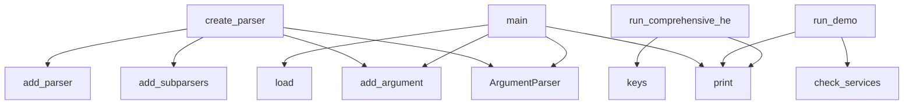

# System Architecture Analysis

## Overview

- **Project**: /home/tom/github/semcod/llx
- **Primary Language**: python
- **Languages**: python: 41, shell: 12
- **Analysis Mode**: static
- **Total Functions**: 482
- **Total Classes**: 57
- **Modules**: 53
- **Entry Points**: 402

## Architecture by Module

### llx.orchestration.routing_engine
- **Functions**: 39
- **Classes**: 6
- **File**: `routing_engine.py`

### llx.orchestration.llm_orchestrator
- **Functions**: 33
- **Classes**: 7
- **File**: `llm_orchestrator.py`

### llx.orchestration.vscode_orchestrator
- **Functions**: 32
- **Classes**: 6
- **File**: `vscode_orchestrator.py`

### llx.tools.config_manager
- **Functions**: 25
- **Classes**: 1
- **File**: `config_manager.py`

### llx.tools.vscode_manager
- **Functions**: 23
- **Classes**: 1
- **File**: `vscode_manager.py`

### llx.orchestration.queue_manager
- **Functions**: 23
- **Classes**: 6
- **File**: `queue_manager.py`

### llx.orchestration.orchestrator_cli
- **Functions**: 22
- **Classes**: 1
- **File**: `orchestrator_cli.py`

### llx.analysis.collector
- **Functions**: 21
- **Classes**: 1
- **File**: `collector.py`

### llx.orchestration.session_manager
- **Functions**: 21
- **Classes**: 5
- **File**: `session_manager.py`

### llx.tools.ai_tools_manager
- **Functions**: 20
- **Classes**: 1
- **File**: `ai_tools_manager.py`

### llx.tools.model_manager
- **Functions**: 20
- **Classes**: 1
- **File**: `model_manager.py`

### llx.orchestration.rate_limiter
- **Functions**: 18
- **Classes**: 4
- **File**: `rate_limiter.py`

### llx.tools.cli
- **Functions**: 15
- **Classes**: 1
- **File**: `cli.py`

### ai-tools-manage
- **Functions**: 15
- **File**: `ai-tools-manage.sh`

### llx.cli.app
- **Functions**: 14
- **File**: `app.py`

### llx.tools.health_checker
- **Functions**: 13
- **Classes**: 1
- **File**: `health_checker.py`

### llx.cli.formatters
- **Functions**: 12
- **File**: `formatters.py`

### examples.vscode-roocode.demo
- **Functions**: 11
- **Classes**: 1
- **File**: `demo.py`

### llx.litellm_config
- **Functions**: 10
- **Classes**: 2
- **File**: `litellm_config.py`

### llx.routing.client
- **Functions**: 9
- **Classes**: 3
- **File**: `client.py`

## Key Entry Points

Main execution flows into the system:

### llx.orchestration.orchestrator_cli.OrchestratorCLI.create_parser
> Create argument parser for CLI.
- **Calls**: argparse.ArgumentParser, parser.add_argument, parser.add_subparsers, subparsers.add_parser, subparsers.add_parser, subparsers.add_parser, subparsers.add_parser, subparsers.add_parser

### llx.tools.cli.LLXToolsCLI.create_parser
> Create argument parser for CLI.
- **Calls**: argparse.ArgumentParser, parser.add_argument, parser.add_subparsers, subparsers.add_parser, env_parser.add_argument, env_parser.add_argument, subparsers.add_parser, stop_parser.add_argument

### llx.tools.config_manager.main
> CLI interface for config manager.
- **Calls**: argparse.ArgumentParser, parser.add_argument, parser.add_argument, parser.add_argument, parser.add_argument, parser.add_argument, parser.add_argument, parser.add_argument

### examples.ai-tools.main.main
- **Calls**: docker.ai-tools.entrypoint.print, docker.ai-tools.entrypoint.print, docker.ai-tools.entrypoint.print, docker.ai-tools.entrypoint.print, docker.ai-tools.entrypoint.print, docker.ai-tools.entrypoint.print, examples.ai-tools.main.check_docker_services, services.items

### llx.tools.model_manager.main
> CLI interface for model manager.
- **Calls**: argparse.ArgumentParser, parser.add_argument, parser.add_argument, parser.add_argument, parser.add_argument, parser.add_argument, parser.add_argument, parser.add_argument

### llx.orchestration.vscode_orchestrator.main
> CLI interface for VS Code orchestrator.
- **Calls**: argparse.ArgumentParser, parser.add_argument, parser.add_argument, parser.add_argument, parser.add_argument, parser.add_argument, parser.add_argument, parser.add_argument

### llx.orchestration.queue_manager.main
> CLI interface for queue manager.
- **Calls**: argparse.ArgumentParser, parser.add_argument, parser.add_argument, parser.add_argument, parser.add_argument, parser.add_argument, parser.add_argument, parser.add_argument

### llx.orchestration.llm_orchestrator.main
> CLI interface for LLM orchestrator.
- **Calls**: argparse.ArgumentParser, parser.add_argument, parser.add_argument, parser.add_argument, parser.add_argument, parser.add_argument, parser.add_argument, parser.add_argument

### llx.orchestration.rate_limiter.main
> CLI interface for rate limiter.
- **Calls**: argparse.ArgumentParser, parser.add_argument, parser.add_argument, parser.add_argument, parser.add_argument, parser.add_argument, parser.add_argument, parser.add_argument

### examples.basic.main.main
> Main example execution
- **Calls**: docker.ai-tools.entrypoint.print, docker.ai-tools.entrypoint.print, docker.ai-tools.entrypoint.print, LlxConfig.load, docker.ai-tools.entrypoint.print, docker.ai-tools.entrypoint.print, docker.ai-tools.entrypoint.print, docker.ai-tools.entrypoint.print

### examples.vscode-roocode.demo.RooCodeDemo.run_demo
> Run complete RooCode demonstration.
- **Calls**: docker.ai-tools.entrypoint.print, docker.ai-tools.entrypoint.print, docker.ai-tools.entrypoint.print, docker.ai-tools.entrypoint.print, self.check_services, docker.ai-tools.entrypoint.print, services.items, self.get_available_models

### llx.orchestration.session_manager.main
> CLI interface for session manager.
- **Calls**: argparse.ArgumentParser, parser.add_argument, parser.add_argument, parser.add_argument, parser.add_argument, parser.add_argument, parser.add_argument, parser.add_argument

### llx.tools.health_checker.HealthChecker.run_comprehensive_health_check
> Run comprehensive health check of entire llx ecosystem.
- **Calls**: docker.ai-tools.entrypoint.print, docker.ai-tools.entrypoint.print, docker.ai-tools.entrypoint.print, self.endpoints.keys, docker.ai-tools.entrypoint.print, self.docker_manager.get_service_status, self.expected_services.items, docker.ai-tools.entrypoint.print

### llx.tools.health_checker.main
> CLI interface for health checker.
- **Calls**: argparse.ArgumentParser, parser.add_argument, parser.add_argument, parser.add_argument, parser.add_argument, parser.add_argument, parser.add_argument, parser.parse_args

### llx.tools.ai_tools_manager.main
> CLI interface for AI tools manager.
- **Calls**: argparse.ArgumentParser, parser.add_argument, parser.add_argument, parser.add_argument, parser.add_argument, parser.add_argument, parser.add_argument, parser.add_argument

### llx.tools.vscode_manager.VSCodeManager.print_quick_start
> Print quick start guide.
- **Calls**: docker.ai-tools.entrypoint.print, docker.ai-tools.entrypoint.print, docker.ai-tools.entrypoint.print, docker.ai-tools.entrypoint.print, docker.ai-tools.entrypoint.print, docker.ai-tools.entrypoint.print, docker.ai-tools.entrypoint.print, docker.ai-tools.entrypoint.print

### llx.tools.model_manager.ModelManager.print_model_summary
> Print comprehensive model summary.
- **Calls**: docker.ai-tools.entrypoint.print, docker.ai-tools.entrypoint.print, self.check_ollama_running, self.check_llx_running, docker.ai-tools.entrypoint.print, docker.ai-tools.entrypoint.print, self.get_system_resources, docker.ai-tools.entrypoint.print

### llx.orchestration.rate_limiter.RateLimiter.load_limits
> Load rate limits from configuration file.
- **Calls**: self.config_file.exists, data.get, docker.ai-tools.entrypoint.print, docker.ai-tools.entrypoint.print, self._create_default_limits, docker.ai-tools.entrypoint.print, open, json.load

### llx.orchestration.vscode_orchestrator.VSCodeOrchestrator.load_config
> Load VS Code orchestration configuration.
- **Calls**: self.config_file.exists, self.config.update, data.get, data.get, data.get, docker.ai-tools.entrypoint.print, docker.ai-tools.entrypoint.print, self._create_default_config

### llx.orchestration.session_manager.SessionManager.load_sessions
> Load sessions from configuration file.
- **Calls**: self.config_file.exists, data.get, docker.ai-tools.entrypoint.print, docker.ai-tools.entrypoint.print, docker.ai-tools.entrypoint.print, open, json.load, SessionConfig

### llx.orchestration.queue_manager.QueueManager.load_queues
> Load queues from configuration file.
- **Calls**: self.config_file.exists, data.get, docker.ai-tools.entrypoint.print, docker.ai-tools.entrypoint.print, docker.ai-tools.entrypoint.print, open, json.load, QueueConfig

### llx.orchestration.orchestrator_cli.OrchestratorCLI._handle_llm
> Handle LLM commands.
- **Calls**: docker.ai-tools.entrypoint.print, self.llm_orchestrator.get_provider_status, docker.ai-tools.entrypoint.print, None.items, docker.ai-tools.entrypoint.print, self.llm_orchestrator.list_models, docker.ai-tools.entrypoint.print, ModelCapability

### llx.orchestration.llm_orchestrator.LLMOrchestrator.load_config
> Load LLM orchestration configuration.
- **Calls**: self.config_file.exists, self.config.update, data.get, docker.ai-tools.entrypoint.print, docker.ai-tools.entrypoint.print, self._create_default_config, docker.ai-tools.entrypoint.print, open

### llx.tools.ai_tools_manager.AIToolsManager.print_usage_examples
> Print usage examples.
- **Calls**: docker.ai-tools.entrypoint.print, docker.ai-tools.entrypoint.print, docker.ai-tools.entrypoint.print, docker.ai-tools.entrypoint.print, docker.ai-tools.entrypoint.print, docker.ai-tools.entrypoint.print, docker.ai-tools.entrypoint.print, docker.ai-tools.entrypoint.print

### llx.orchestration.orchestrator_cli.OrchestratorCLI._handle_vscode
> Handle VS Code commands.
- **Calls**: docker.ai-tools.entrypoint.print, self.vscode_orchestrator.start_instance, docker.ai-tools.entrypoint.print, docker.ai-tools.entrypoint.print, docker.ai-tools.entrypoint.print, self.vscode_orchestrator.get_session_status, docker.ai-tools.entrypoint.print, self.vscode_orchestrator.remove_instance

### llx.orchestration.routing_engine.main
> CLI interface for routing engine.
- **Calls**: argparse.ArgumentParser, parser.add_argument, parser.add_argument, parser.add_argument, parser.add_argument, parser.add_argument, parser.add_argument, parser.add_argument

### llx.orchestration.queue_manager.QueueManager.print_status_summary
> Print comprehensive status summary.
- **Calls**: docker.ai-tools.entrypoint.print, docker.ai-tools.entrypoint.print, len, sum, sum, sum, docker.ai-tools.entrypoint.print, docker.ai-tools.entrypoint.print

### llx.tools.vscode_manager.main
> CLI interface for VS Code manager.
- **Calls**: argparse.ArgumentParser, parser.add_argument, parser.add_argument, parser.add_argument, parser.add_argument, parser.parse_args, VSCodeManager, sys.exit

### llx.tools.config_manager.ConfigManager.print_config_summary
> Print comprehensive configuration summary.
- **Calls**: self.get_config_summary, docker.ai-tools.entrypoint.print, docker.ai-tools.entrypoint.print, docker.ai-tools.entrypoint.print, None.items, docker.ai-tools.entrypoint.print, docker.ai-tools.entrypoint.print, docker.ai-tools.entrypoint.print

### llx.tools.health_checker.HealthChecker.monitor_services
> Monitor services over time.
- **Calls**: docker.ai-tools.entrypoint.print, docker.ai-tools.entrypoint.print, time.time, docker.ai-tools.entrypoint.print, self._analyze_monitoring_data, docker.ai-tools.entrypoint.print, docker.ai-tools.entrypoint.print, docker.ai-tools.entrypoint.print

## Process Flows

Key execution flows identified:

### Flow 1: create_parser
```
create_parser [llx.orchestration.orchestrator_cli.OrchestratorCLI]
```

### Flow 2: main
```
main [llx.tools.config_manager]
```

### Flow 3: run_demo
```
run_demo [examples.vscode-roocode.demo.RooCodeDemo]
  └─ →> print
  └─ →> print
```

### Flow 4: run_comprehensive_health_check
```
run_comprehensive_health_check [llx.tools.health_checker.HealthChecker]
  └─ →> print
  └─ →> print
```

### Flow 5: print_quick_start
```
print_quick_start [llx.tools.vscode_manager.VSCodeManager]
  └─ →> print
  └─ →> print
```

### Flow 6: print_model_summary
```
print_model_summary [llx.tools.model_manager.ModelManager]
  └─ →> print
  └─ →> print
```

### Flow 7: load_limits
```
load_limits [llx.orchestration.rate_limiter.RateLimiter]
  └─ →> print
  └─ →> print
```

### Flow 8: load_config
```
load_config [llx.orchestration.vscode_orchestrator.VSCodeOrchestrator]
```

### Flow 9: load_sessions
```
load_sessions [llx.orchestration.session_manager.SessionManager]
  └─ →> print
  └─ →> print
```

## Key Classes

### llx.orchestration.routing_engine.RoutingEngine
> Intelligent routing engine for LLM and VS Code requests.
- **Methods**: 38
- **Key Methods**: llx.orchestration.routing_engine.RoutingEngine.__init__, llx.orchestration.routing_engine.RoutingEngine.load_config, llx.orchestration.routing_engine.RoutingEngine.save_config, llx.orchestration.routing_engine.RoutingEngine.route_request, llx.orchestration.routing_engine.RoutingEngine._get_candidates, llx.orchestration.routing_engine.RoutingEngine._get_llm_candidates, llx.orchestration.routing_engine.RoutingEngine._get_vscode_candidates, llx.orchestration.routing_engine.RoutingEngine._get_ai_tools_candidates, llx.orchestration.routing_engine.RoutingEngine._filter_candidates, llx.orchestration.routing_engine.RoutingEngine._filter_by_rate_limits

### llx.orchestration.llm_orchestrator.LLMOrchestrator
> Orchestrates multiple LLM providers and models with intelligent routing.
- **Methods**: 32
- **Key Methods**: llx.orchestration.llm_orchestrator.LLMOrchestrator.__init__, llx.orchestration.llm_orchestrator.LLMOrchestrator.load_config, llx.orchestration.llm_orchestrator.LLMOrchestrator.save_config, llx.orchestration.llm_orchestrator.LLMOrchestrator._create_default_config, llx.orchestration.llm_orchestrator.LLMOrchestrator.start, llx.orchestration.llm_orchestrator.LLMOrchestrator.stop, llx.orchestration.llm_orchestrator.LLMOrchestrator.add_provider, llx.orchestration.llm_orchestrator.LLMOrchestrator.remove_provider, llx.orchestration.llm_orchestrator.LLMOrchestrator.add_model, llx.orchestration.llm_orchestrator.LLMOrchestrator.complete_request

### llx.orchestration.vscode_orchestrator.VSCodeOrchestrator
> Orchestrates multiple VS Code instances with intelligent management.
- **Methods**: 27
- **Key Methods**: llx.orchestration.vscode_orchestrator.VSCodeOrchestrator.__init__, llx.orchestration.vscode_orchestrator.VSCodeOrchestrator.load_config, llx.orchestration.vscode_orchestrator.VSCodeOrchestrator.save_config, llx.orchestration.vscode_orchestrator.VSCodeOrchestrator._create_default_config, llx.orchestration.vscode_orchestrator.VSCodeOrchestrator.start, llx.orchestration.vscode_orchestrator.VSCodeOrchestrator.stop, llx.orchestration.vscode_orchestrator.VSCodeOrchestrator.add_account, llx.orchestration.vscode_orchestrator.VSCodeOrchestrator.remove_account, llx.orchestration.vscode_orchestrator.VSCodeOrchestrator.create_instance, llx.orchestration.vscode_orchestrator.VSCodeOrchestrator.remove_instance

### llx.tools.config_manager.ConfigManager
> Manages llx configuration files and settings.
- **Methods**: 24
- **Key Methods**: llx.tools.config_manager.ConfigManager.__init__, llx.tools.config_manager.ConfigManager.load_config, llx.tools.config_manager.ConfigManager.save_config, llx.tools.config_manager.ConfigManager._load_env_file, llx.tools.config_manager.ConfigManager._save_env_file, llx.tools.config_manager.ConfigManager.create_default_env, llx.tools.config_manager.ConfigManager.update_env_var, llx.tools.config_manager.ConfigManager.get_env_var, llx.tools.config_manager.ConfigManager.validate_env_config, llx.tools.config_manager.ConfigManager.get_llx_config

### llx.tools.vscode_manager.VSCodeManager
> Manages VS Code server with AI extensions.
- **Methods**: 22
- **Key Methods**: llx.tools.vscode_manager.VSCodeManager.__init__, llx.tools.vscode_manager.VSCodeManager.is_vscode_running, llx.tools.vscode_manager.VSCodeManager.start_vscode, llx.tools.vscode_manager.VSCodeManager.stop_vscode, llx.tools.vscode_manager.VSCodeManager.restart_vscode, llx.tools.vscode_manager.VSCodeManager.wait_for_vscode_ready, llx.tools.vscode_manager.VSCodeManager.check_vscode_health, llx.tools.vscode_manager.VSCodeManager.get_vscode_url, llx.tools.vscode_manager.VSCodeManager.get_vscode_password, llx.tools.vscode_manager.VSCodeManager.install_extensions

### llx.orchestration.orchestrator_cli.OrchestratorCLI
> Unified CLI for llx orchestration system.
- **Methods**: 21
- **Key Methods**: llx.orchestration.orchestrator_cli.OrchestratorCLI.__init__, llx.orchestration.orchestrator_cli.OrchestratorCLI.create_parser, llx.orchestration.orchestrator_cli.OrchestratorCLI.run_command, llx.orchestration.orchestrator_cli.OrchestratorCLI._handle_start, llx.orchestration.orchestrator_cli.OrchestratorCLI._handle_stop, llx.orchestration.orchestrator_cli.OrchestratorCLI._handle_restart, llx.orchestration.orchestrator_cli.OrchestratorCLI._handle_status, llx.orchestration.orchestrator_cli.OrchestratorCLI._handle_health, llx.orchestration.orchestrator_cli.OrchestratorCLI._handle_monitor, llx.orchestration.orchestrator_cli.OrchestratorCLI._handle_vscode

### llx.orchestration.queue_manager.QueueManager
> Manages multiple request queues with intelligent prioritization.
- **Methods**: 21
- **Key Methods**: llx.orchestration.queue_manager.QueueManager.__init__, llx.orchestration.queue_manager.QueueManager.load_queues, llx.orchestration.queue_manager.QueueManager.save_queues, llx.orchestration.queue_manager.QueueManager.start, llx.orchestration.queue_manager.QueueManager.stop, llx.orchestration.queue_manager.QueueManager.add_queue, llx.orchestration.queue_manager.QueueManager.remove_queue, llx.orchestration.queue_manager.QueueManager.enqueue_request, llx.orchestration.queue_manager.QueueManager.dequeue_request, llx.orchestration.queue_manager.QueueManager.complete_request

### llx.orchestration.session_manager.SessionManager
> Manages multiple LLM and VS Code sessions with intelligent routing.
- **Methods**: 20
- **Key Methods**: llx.orchestration.session_manager.SessionManager.__init__, llx.orchestration.session_manager.SessionManager.load_sessions, llx.orchestration.session_manager.SessionManager.save_sessions, llx.orchestration.session_manager.SessionManager.create_session, llx.orchestration.session_manager.SessionManager.remove_session, llx.orchestration.session_manager.SessionManager.get_available_session, llx.orchestration.session_manager.SessionManager.request_session, llx.orchestration.session_manager.SessionManager.release_session, llx.orchestration.session_manager.SessionManager.get_session_status, llx.orchestration.session_manager.SessionManager.list_sessions

### llx.tools.ai_tools_manager.AIToolsManager
> Manages AI tools container and operations.
- **Methods**: 19
- **Key Methods**: llx.tools.ai_tools_manager.AIToolsManager.__init__, llx.tools.ai_tools_manager.AIToolsManager.is_container_running, llx.tools.ai_tools_manager.AIToolsManager.start_ai_tools, llx.tools.ai_tools_manager.AIToolsManager.stop_ai_tools, llx.tools.ai_tools_manager.AIToolsManager.restart_ai_tools, llx.tools.ai_tools_manager.AIToolsManager.access_shell, llx.tools.ai_tools_manager.AIToolsManager.execute_command, llx.tools.ai_tools_manager.AIToolsManager.get_status, llx.tools.ai_tools_manager.AIToolsManager.test_connectivity, llx.tools.ai_tools_manager.AIToolsManager.run_chat_test

### llx.tools.model_manager.ModelManager
> Manages local Ollama models and llx configurations.
- **Methods**: 19
- **Key Methods**: llx.tools.model_manager.ModelManager.__init__, llx.tools.model_manager.ModelManager.check_ollama_running, llx.tools.model_manager.ModelManager.check_llx_running, llx.tools.model_manager.ModelManager.get_ollama_models, llx.tools.model_manager.ModelManager.get_llx_models, llx.tools.model_manager.ModelManager.pull_model, llx.tools.model_manager.ModelManager.remove_model, llx.tools.model_manager.ModelManager.test_model, llx.tools.model_manager.ModelManager.test_llx_model, llx.tools.model_manager.ModelManager.get_model_info

### llx.orchestration.rate_limiter.RateLimiter
> Manages rate limiting for multiple providers and accounts.
- **Methods**: 17
- **Key Methods**: llx.orchestration.rate_limiter.RateLimiter.__init__, llx.orchestration.rate_limiter.RateLimiter.load_limits, llx.orchestration.rate_limiter.RateLimiter.save_limits, llx.orchestration.rate_limiter.RateLimiter._create_default_limits, llx.orchestration.rate_limiter.RateLimiter.add_limit, llx.orchestration.rate_limiter.RateLimiter.remove_limit, llx.orchestration.rate_limiter.RateLimiter.check_rate_limit, llx.orchestration.rate_limiter.RateLimiter.record_request, llx.orchestration.rate_limiter.RateLimiter.release_request, llx.orchestration.rate_limiter.RateLimiter.get_status

### llx.tools.cli.LLXToolsCLI
> Unified CLI for llx ecosystem management.
- **Methods**: 14
- **Key Methods**: llx.tools.cli.LLXToolsCLI.__init__, llx.tools.cli.LLXToolsCLI.create_parser, llx.tools.cli.LLXToolsCLI.run_command, llx.tools.cli.LLXToolsCLI._handle_start, llx.tools.cli.LLXToolsCLI._handle_stop, llx.tools.cli.LLXToolsCLI._handle_restart, llx.tools.cli.LLXToolsCLI._handle_status, llx.tools.cli.LLXToolsCLI._handle_health, llx.tools.cli.LLXToolsCLI._handle_docker, llx.tools.cli.LLXToolsCLI._handle_ai_tools

### llx.tools.health_checker.HealthChecker
> Comprehensive health monitoring for llx ecosystem.
- **Methods**: 12
- **Key Methods**: llx.tools.health_checker.HealthChecker.__init__, llx.tools.health_checker.HealthChecker.check_service_health, llx.tools.health_checker.HealthChecker.check_container_health, llx.tools.health_checker.HealthChecker.check_system_resources, llx.tools.health_checker.HealthChecker.check_filesystem_health, llx.tools.health_checker.HealthChecker.check_network_connectivity, llx.tools.health_checker.HealthChecker.run_comprehensive_health_check, llx.tools.health_checker.HealthChecker._generate_recommendations, llx.tools.health_checker.HealthChecker._print_health_summary, llx.tools.health_checker.HealthChecker.run_quick_health_check

### examples.vscode-roocode.demo.RooCodeDemo
> Demo class for RooCode AI assistant capabilities.
- **Methods**: 10
- **Key Methods**: examples.vscode-roocode.demo.RooCodeDemo.__init__, examples.vscode-roocode.demo.RooCodeDemo.check_services, examples.vscode-roocode.demo.RooCodeDemo.get_available_models, examples.vscode-roocode.demo.RooCodeDemo.test_chat_completion, examples.vscode-roocode.demo.RooCodeDemo.demonstrate_code_generation, examples.vscode-roocode.demo.RooCodeDemo.demonstrate_code_explanation, examples.vscode-roocode.demo.RooCodeDemo.demonstrate_refactoring, examples.vscode-roocode.demo.RooCodeDemo.demonstrate_test_generation, examples.vscode-roocode.demo.RooCodeDemo.demonstrate_documentation, examples.vscode-roocode.demo.RooCodeDemo.run_demo

### llx.litellm_config.LiteLLMConfig
> Complete LiteLLM configuration.
- **Methods**: 9
- **Key Methods**: llx.litellm_config.LiteLLMConfig.load, llx.litellm_config.LiteLLMConfig._default_config, llx.litellm_config.LiteLLMConfig.get_model_config, llx.litellm_config.LiteLLMConfig.get_models_by_tag, llx.litellm_config.LiteLLMConfig.get_models_by_provider, llx.litellm_config.LiteLLMConfig.get_models_by_tier, llx.litellm_config.LiteLLMConfig.resolve_alias, llx.litellm_config.LiteLLMConfig.to_llx_models, llx.litellm_config.LiteLLMConfig.get_proxy_config

### llx.routing.client.LlxClient
> LLM client that routes through LiteLLM proxy or calls directly.

Usage:
    client = LlxClient(confi
- **Methods**: 9
- **Key Methods**: llx.routing.client.LlxClient.__init__, llx.routing.client.LlxClient.chat, llx.routing.client.LlxClient.chat_with_context, llx.routing.client.LlxClient._build_payload, llx.routing.client.LlxClient._parse_response, llx.routing.client.LlxClient._fallback_direct, llx.routing.client.LlxClient.close, llx.routing.client.LlxClient.__enter__, llx.routing.client.LlxClient.__exit__

### examples.proxy.main.ProxyExample
- **Methods**: 6
- **Key Methods**: examples.proxy.main.ProxyExample.__init__, examples.proxy.main.ProxyExample.setup_server, examples.proxy.main.ProxyExample.start_server, examples.proxy.main.ProxyExample.test_proxy, examples.proxy.main.ProxyExample.show_ide_integration, examples.proxy.main.ProxyExample.cleanup

### llx.orchestration.vscode_orchestrator.VSCodePortAllocator
> Manages port allocation for VS Code instances.
- **Methods**: 4
- **Key Methods**: llx.orchestration.vscode_orchestrator.VSCodePortAllocator.__init__, llx.orchestration.vscode_orchestrator.VSCodePortAllocator.allocate_port, llx.orchestration.vscode_orchestrator.VSCodePortAllocator.release_port, llx.orchestration.vscode_orchestrator.VSCodePortAllocator._is_port_available

### llx.analysis.collector.ProjectMetrics
> Aggregated project metrics that drive model selection.

Every field maps to a real, measurable prope
- **Methods**: 3
- **Key Methods**: llx.analysis.collector.ProjectMetrics.complexity_score, llx.analysis.collector.ProjectMetrics.scale_score, llx.analysis.collector.ProjectMetrics.coupling_score

### llx.routing.client.ChatResponse
> Response from LLM completion.
- **Methods**: 3
- **Key Methods**: llx.routing.client.ChatResponse.prompt_tokens, llx.routing.client.ChatResponse.completion_tokens, llx.routing.client.ChatResponse.total_tokens

## Data Transformation Functions

Key functions that process and transform data:

### llx.analysis.collector._parse_map_stats_line
> Parse: # stats: 814 func | 0 cls | 108 mod | CC̄=4.6
- **Output to**: line.split, part.strip, re.search, re.search, re.search

### llx.analysis.collector._parse_map_alerts_line
> Parse: # alerts[5]: CC _extract=65; fan-out _extract=45
- **Output to**: re.finditer, re.finditer, max, max, int

### llx.analysis.collector._parse_map_hotspots_line
> Parse: # hotspots[5]: _extract fan=45; ...
- **Output to**: re.search, re.finditer, max, max, int

### llx.tools.cli.LLXToolsCLI.create_parser
> Create argument parser for CLI.
- **Output to**: argparse.ArgumentParser, parser.add_argument, parser.add_subparsers, subparsers.add_parser, env_parser.add_argument

### llx.tools.config_manager.ConfigManager.validate_env_config
> Validate environment configuration.
- **Output to**: self.load_config, env_vars.get, env_vars.get, env_vars.get, None.append

### llx.tools.config_manager.ConfigManager.validate_docker_configs
> Validate Docker configuration files.
- **Output to**: self.load_config, file_path.exists, None.append, config.get, None.append

### llx.orchestration.orchestrator_cli.OrchestratorCLI.create_parser
> Create argument parser for CLI.
- **Output to**: argparse.ArgumentParser, parser.add_argument, parser.add_subparsers, subparsers.add_parser, subparsers.add_parser

### llx.orchestration.routing_engine.RoutingEngine._validate_decision
> Validate routing decision.
- **Output to**: self.session_manager.get_session_status, self.rate_limiter.check_rate_limit, self.instance_manager.get_instance_status

### llx.mcp.tools._handle_vallm_validate
> Run vallm validation on code or project.
- **Output to**: Path, Path, llx.analysis.runner.run_vallm, Proposal, validate

### llx.routing.client.LlxClient._parse_response
- **Output to**: data.get, data.get, ChatResponse, data.get, usage.get

### llx.orchestration.queue_manager.QueueManager._process_request
> Process a single request.
- **Output to**: time.sleep, time.time, request.created_at.timestamp

## Behavioral Patterns

### state_machine_LlxClient
- **Type**: state_machine
- **Confidence**: 0.70
- **Functions**: llx.routing.client.LlxClient.__init__, llx.routing.client.LlxClient.chat, llx.routing.client.LlxClient.chat_with_context, llx.routing.client.LlxClient._build_payload, llx.routing.client.LlxClient._parse_response

## Public API Surface

Functions exposed as public API (no underscore prefix):

- `llx.orchestration.orchestrator_cli.OrchestratorCLI.create_parser` - 111 calls
- `llx.tools.cli.LLXToolsCLI.create_parser` - 81 calls
- `llx.tools.config_manager.main` - 60 calls
- `examples.ai-tools.main.main` - 58 calls
- `llx.tools.model_manager.main` - 56 calls
- `llx.orchestration.vscode_orchestrator.main` - 56 calls
- `llx.orchestration.queue_manager.main` - 54 calls
- `llx.orchestration.llm_orchestrator.main` - 47 calls
- `llx.orchestration.rate_limiter.main` - 46 calls
- `examples.basic.main.main` - 43 calls
- `examples.vscode-roocode.demo.RooCodeDemo.run_demo` - 42 calls
- `llx.orchestration.session_manager.main` - 41 calls
- `llx.tools.health_checker.HealthChecker.run_comprehensive_health_check` - 39 calls
- `llx.tools.health_checker.main` - 38 calls
- `llx.tools.ai_tools_manager.main` - 37 calls
- `llx.tools.vscode_manager.VSCodeManager.print_quick_start` - 36 calls
- `llx.tools.model_manager.ModelManager.print_model_summary` - 36 calls
- `llx.orchestration.rate_limiter.RateLimiter.load_limits` - 36 calls
- `llx.orchestration.vscode_orchestrator.VSCodeOrchestrator.load_config` - 36 calls
- `llx.orchestration.session_manager.SessionManager.load_sessions` - 34 calls
- `llx.orchestration.queue_manager.QueueManager.load_queues` - 34 calls
- `llx.orchestration.llm_orchestrator.LLMOrchestrator.load_config` - 32 calls
- `llx.tools.ai_tools_manager.AIToolsManager.print_usage_examples` - 31 calls
- `llx.orchestration.routing_engine.main` - 31 calls
- `llx.orchestration.queue_manager.QueueManager.print_status_summary` - 30 calls
- `llx.tools.vscode_manager.main` - 29 calls
- `llx.tools.config_manager.ConfigManager.print_config_summary` - 29 calls
- `llx.tools.health_checker.HealthChecker.monitor_services` - 29 calls
- `examples.ai-tools.main.show_usage_examples` - 29 calls
- `llx.orchestration.rate_limiter.RateLimiter.print_status_summary` - 28 calls
- `llx.orchestration.session_manager.SessionManager.print_status_summary` - 26 calls
- `llx.orchestration.vscode_orchestrator.VSCodeOrchestrator.print_status_summary` - 25 calls
- `examples.docker.main.main` - 25 calls
- `llx.tools.vscode_manager.VSCodeManager.install_extensions` - 24 calls
- `examples.multi-provider.main.main` - 24 calls
- `llx.config.LlxConfig.load` - 23 calls
- `llx.tools.config_manager.ConfigManager.restore_configs` - 23 calls
- `llx.orchestration.vscode_orchestrator.VSCodeOrchestrator.start_instance` - 23 calls
- `examples.local.main.demonstrate_local_model_selection` - 23 calls
- `llx.orchestration.llm_orchestrator.LLMOrchestrator.print_status_summary` - 22 calls

## System Interactions

How components interact:



## Reverse Engineering Guidelines

1. **Entry Points**: Start analysis from the entry points listed above
2. **Core Logic**: Focus on classes with many methods
3. **Data Flow**: Follow data transformation functions
4. **Process Flows**: Use the flow diagrams for execution paths
5. **API Surface**: Public API functions reveal the interface

## Context for LLM

Maintain the identified architectural patterns and public API surface when suggesting changes.