# System Architecture Analysis

## Overview

- **Project**: /home/tom/github/semcod/llx
- **Primary Language**: python
- **Languages**: python: 18, shell: 5
- **Analysis Mode**: static
- **Total Functions**: 77
- **Total Classes**: 12
- **Modules**: 23
- **Entry Points**: 35

## Architecture by Module

### llx.analysis.collector
- **Functions**: 14
- **Classes**: 1
- **File**: `collector.py`

### llx.cli.app
- **Functions**: 11
- **File**: `app.py`

### llx.routing.client
- **Functions**: 9
- **Classes**: 3
- **File**: `client.py`

### examples.proxy.main
- **Functions**: 8
- **Classes**: 1
- **File**: `main.py`

### examples.local.main
- **Functions**: 7
- **File**: `main.py`

### llx.analysis.runner
- **Functions**: 6
- **Classes**: 1
- **File**: `runner.py`

### llx.routing.selector
- **Functions**: 6
- **Classes**: 2
- **File**: `selector.py`

### examples.multi-provider.main
- **Functions**: 5
- **File**: `main.py`

### llx.cli.formatters
- **Functions**: 4
- **File**: `formatters.py`

### llx.config
- **Functions**: 3
- **Classes**: 4
- **File**: `config.py`

### llx.integrations.proxy
- **Functions**: 3
- **File**: `proxy.py`

### examples.basic.main
- **Functions**: 1
- **File**: `main.py`

## Key Entry Points

Main execution flows into the system:

### examples.basic.main.main
> Main example execution
- **Calls**: print, print, print, LlxConfig.load, print, print, print, print

### examples.multi-provider.main.main
> Main multi-provider example execution
- **Calls**: print, print, print, examples.multi-provider.main.check_provider_keys, print, providers.items, examples.multi-provider.main.compare_provider_costs, examples.multi-provider.main.demonstrate_fallback_strategy

### examples.proxy.main.ProxyExample.test_proxy
> Test the proxy with a simple request
- **Calls**: print, time.sleep, requests.get, requests.post, os.getenv, os.getenv, response.json, print

### examples.proxy.main.ProxyExample.show_ide_integration
> Show IDE integration instructions
- **Calls**: print, print, print, print, print, print, print, print

### llx.cli.app.chat
> Analyze project, select model, and send a prompt.
- **Calls**: app.command, typer.Argument, typer.Option, typer.Option, typer.Option, typer.Option, typer.Option, None.resolve

### examples.local.main.main
> Main local models example execution
- **Calls**: print, print, examples.local.main.check_ollama_installation, examples.local.main.check_ollama_service, examples.local.main.list_recommended_local_models, examples.local.main.estimate_resource_requirements, print, print

### llx.cli.app.analyze
> Analyze a project and recommend the optimal LLM model.
- **Calls**: app.command, typer.Argument, typer.Option, typer.Option, typer.Option, typer.Option, typer.Option, typer.Option

### examples.proxy.main.ProxyExample.setup_server
> Initialize the proxy server
- **Calls**: print, ProxyRouter, aliases.items, ProxyServer, print, os.getenv, os.getenv, os.getenv

### llx.config.LlxConfig.load
> Load configuration from llx.toml or pyproject.toml.
- **Calls**: None.resolve, cls, pyproject.exists, llx.config._apply_env, toml_path.exists, None.get, Path, llx.config._apply_toml

### examples.proxy.main.main
> Main proxy example execution
- **Calls**: signal.signal, signal.signal, print, print, ProxyExample, example.show_ide_integration, print, print

### llx.cli.app.select
> Quick model selection from existing analysis files.
- **Calls**: app.command, typer.Argument, typer.Option, typer.Option, typer.Option, None.resolve, LlxConfig.load, llx.analysis.collector.analyze_project

### llx.cli.app.proxy_start
> Start LiteLLM proxy server with llx configuration.
- **Calls**: proxy_app.command, typer.Option, typer.Option, typer.Option, LlxConfig.load, console.print, Path, llx.integrations.proxy.start_proxy

### examples.proxy.main.ProxyExample.start_server
> Start the proxy server
- **Calls**: print, self.server.start, print, print, print, print, os.getenv, os.getenv

### llx.cli.app.init
> Initialize llx.toml configuration file.
- **Calls**: app.command, typer.Argument, config_path.exists, config_path.write_text, console.print, None.resolve, console.print, typer.Exit

### llx.routing.client.LlxClient.chat
> Send a chat completion request.

Args:
    messages: Chat messages.
    model: Model identifier (e.g. "anthropic/claude-sonnet-4-20250514").
         
- **Calls**: self._build_payload, self.config.models.get, self._http.post, response.raise_for_status, response.json, self._parse_response, self._fallback_direct, RuntimeError

### llx.routing.client.LlxClient._parse_response
- **Calls**: data.get, data.get, ChatResponse, data.get, usage.get, usage.get, usage.get

### llx.cli.app.proxy_config
> Generate LiteLLM proxy config.
- **Calls**: proxy_app.command, typer.Option, LlxConfig.load, llx.integrations.proxy.generate_proxy_config, console.print, Path

### llx.cli.app.models
> Show available models with optional filtering by tags, provider, or tier.
- **Calls**: app.command, typer.Argument, typer.Option, typer.Option, LlxConfig.load, llx.cli.formatters.print_models_table

### examples.proxy.main.ProxyExample.cleanup
> Clean up resources
- **Calls**: print, self.server.stop, print, print

### examples.proxy.main.signal_handler
> Handle shutdown signals
- **Calls**: print, sys.exit, globals, example.cleanup

### llx.cli.app.proxy_status
> Check if proxy is running.
- **Calls**: proxy_app.command, LlxConfig.load, llx.integrations.proxy.check_proxy, console.print

### llx.routing.client.LlxClient._fallback_direct
> Fallback to direct litellm call when proxy is not running.
- **Calls**: litellm.completion, ChatResponse, RuntimeError

### llx.cli.app.info
> Show available tools, models, and configuration.
- **Calls**: app.command, llx.cli.formatters.print_info_tables, LlxConfig.load

### llx.analysis.runner.run_code2llm
- **Calls**: llx.analysis.runner._run_tool, str, str

### llx.analysis.runner.run_redup
- **Calls**: llx.analysis.runner._run_tool, str, str

### llx.routing.selector.SelectionResult.explain
> Human-readable explanation of why this model was selected.
- **Calls**: None.join, lines.append, lines.append

### llx.routing.client.LlxClient.__init__
- **Calls**: httpx.Client, LlxConfig

### llx.routing.client.LlxClient.chat_with_context
> Convenience method: send prompt with code context.

Args:
    prompt: The user's question or instruction.
    context: Code analysis context (from cod
- **Calls**: self.chat, ChatMessage

### llx.routing.client.LlxClient._build_payload
- **Calls**: msg_list.extend, msg_list.append

### llx.analysis.runner.run_vallm
- **Calls**: llx.analysis.runner._run_tool, str

## Process Flows

Key execution flows identified:

### Flow 1: main
```
main [examples.basic.main]
```

### Flow 2: test_proxy
```
test_proxy [examples.proxy.main.ProxyExample]
```

### Flow 3: show_ide_integration
```
show_ide_integration [examples.proxy.main.ProxyExample]
```

### Flow 4: chat
```
chat [llx.cli.app]
```

### Flow 5: analyze
```
analyze [llx.cli.app]
```

### Flow 6: setup_server
```
setup_server [examples.proxy.main.ProxyExample]
```

### Flow 7: load
```
load [llx.config.LlxConfig]
  └─ →> _apply_env
```

### Flow 8: select
```
select [llx.cli.app]
```

### Flow 9: proxy_start
```
proxy_start [llx.cli.app]
```

### Flow 10: start_server
```
start_server [examples.proxy.main.ProxyExample]
```

## Key Classes

### llx.routing.client.LlxClient
> LLM client that routes through LiteLLM proxy or calls directly.

Usage:
    client = LlxClient(confi
- **Methods**: 9
- **Key Methods**: llx.routing.client.LlxClient.__init__, llx.routing.client.LlxClient.chat, llx.routing.client.LlxClient.chat_with_context, llx.routing.client.LlxClient._build_payload, llx.routing.client.LlxClient._parse_response, llx.routing.client.LlxClient._fallback_direct, llx.routing.client.LlxClient.close, llx.routing.client.LlxClient.__enter__, llx.routing.client.LlxClient.__exit__

### examples.proxy.main.ProxyExample
- **Methods**: 6
- **Key Methods**: examples.proxy.main.ProxyExample.__init__, examples.proxy.main.ProxyExample.setup_server, examples.proxy.main.ProxyExample.start_server, examples.proxy.main.ProxyExample.test_proxy, examples.proxy.main.ProxyExample.show_ide_integration, examples.proxy.main.ProxyExample.cleanup

### llx.analysis.collector.ProjectMetrics
> Aggregated project metrics that drive model selection.

Every field maps to a real, measurable prope
- **Methods**: 3
- **Key Methods**: llx.analysis.collector.ProjectMetrics.complexity_score, llx.analysis.collector.ProjectMetrics.scale_score, llx.analysis.collector.ProjectMetrics.coupling_score

### llx.routing.client.ChatResponse
> Response from LLM completion.
- **Methods**: 3
- **Key Methods**: llx.routing.client.ChatResponse.prompt_tokens, llx.routing.client.ChatResponse.completion_tokens, llx.routing.client.ChatResponse.total_tokens

### llx.routing.selector.SelectionResult
> Result of model selection with explanation.
- **Methods**: 2
- **Key Methods**: llx.routing.selector.SelectionResult.model_id, llx.routing.selector.SelectionResult.explain

### llx.config.LlxConfig
> Root configuration for llx.
- **Methods**: 1
- **Key Methods**: llx.config.LlxConfig.load

### llx.config.ModelConfig
> Configuration for a single model tier.
- **Methods**: 0

### llx.config.TierThresholds
> Thresholds that determine which model tier to use.

Based on real project metrics from code2llm anal
- **Methods**: 0

### llx.config.ProxyConfig
> LiteLLM proxy settings.
- **Methods**: 0

### llx.routing.client.ChatMessage
> A single chat message.
- **Methods**: 0

### llx.analysis.runner.ToolResult
- **Methods**: 0

### llx.routing.selector.ModelTier
> LLM model tiers ranked by capability and cost.
- **Methods**: 0
- **Inherits**: str, Enum

## Data Transformation Functions

Key functions that process and transform data:

### llx.routing.client.LlxClient._parse_response
- **Output to**: data.get, data.get, ChatResponse, data.get, usage.get

## Behavioral Patterns

### state_machine_LlxClient
- **Type**: state_machine
- **Confidence**: 0.70
- **Functions**: llx.routing.client.LlxClient.__init__, llx.routing.client.LlxClient.chat, llx.routing.client.LlxClient.chat_with_context, llx.routing.client.LlxClient._build_payload, llx.routing.client.LlxClient._parse_response

## Public API Surface

Functions exposed as public API (no underscore prefix):

- `llx.cli.formatters.print_models_table` - 43 calls
- `examples.basic.main.main` - 43 calls
- `llx.cli.formatters.print_info_tables` - 42 calls
- `examples.multi-provider.main.main` - 24 calls
- `examples.local.main.demonstrate_local_model_selection` - 23 calls
- `examples.proxy.main.ProxyExample.test_proxy` - 22 calls
- `examples.proxy.main.ProxyExample.show_ide_integration` - 21 calls
- `llx.cli.app.chat` - 20 calls
- `examples.local.main.main` - 20 calls
- `llx.cli.app.analyze` - 19 calls
- `examples.local.main.show_ollama_setup_instructions` - 19 calls
- `examples.multi-provider.main.demonstrate_fallback_strategy` - 17 calls
- `examples.multi-provider.main.simulate_multi_provider_selection` - 17 calls
- `examples.proxy.main.ProxyExample.setup_server` - 16 calls
- `llx.config.LlxConfig.load` - 15 calls
- `examples.proxy.main.main` - 14 calls
- `examples.local.main.estimate_resource_requirements` - 14 calls
- `llx.routing.selector.select_model` - 14 calls
- `examples.multi-provider.main.compare_provider_costs` - 12 calls
- `llx.cli.app.select` - 12 calls
- `llx.integrations.proxy.start_proxy` - 11 calls
- `llx.cli.app.proxy_start` - 11 calls
- `examples.local.main.check_ollama_service` - 11 calls
- `examples.local.main.list_recommended_local_models` - 11 calls
- `llx.analysis.collector.analyze_project` - 10 calls
- `examples.proxy.main.ProxyExample.start_server` - 9 calls
- `llx.cli.app.init` - 9 calls
- `llx.routing.selector.select_with_context_check` - 9 calls
- `llx.routing.client.LlxClient.chat` - 8 calls
- `llx.cli.formatters.output_rich` - 7 calls
- `llx.cli.app.proxy_config` - 6 calls
- `llx.cli.app.models` - 6 calls
- `examples.local.main.check_ollama_installation` - 6 calls
- `llx.integrations.proxy.generate_proxy_config` - 5 calls
- `examples.multi-provider.main.check_provider_keys` - 5 calls
- `examples.proxy.main.ProxyExample.cleanup` - 4 calls
- `examples.proxy.main.signal_handler` - 4 calls
- `llx.cli.app.proxy_status` - 4 calls
- `llx.cli.app.info` - 3 calls
- `llx.analysis.runner.run_code2llm` - 3 calls

## System Interactions

How components interact:

```mermaid
graph TD
    main --> print
    main --> load
    main --> check_provider_keys
    test_proxy --> print
    test_proxy --> sleep
    test_proxy --> get
    test_proxy --> post
    test_proxy --> getenv
    show_ide_integration --> print
    chat --> command
    chat --> Argument
    chat --> Option
    main --> check_ollama_install
    main --> check_ollama_service
    main --> list_recommended_loc
    analyze --> command
    analyze --> Argument
    analyze --> Option
    setup_server --> print
    setup_server --> ProxyRouter
    setup_server --> items
    setup_server --> ProxyServer
    load --> resolve
    load --> cls
    load --> exists
    load --> _apply_env
    main --> signal
    main --> ProxyExample
    select --> command
    select --> Argument
```



## Reverse Engineering Guidelines

1. **Entry Points**: Start analysis from the entry points listed above
2. **Core Logic**: Focus on classes with many methods
3. **Data Flow**: Follow data transformation functions
4. **Process Flows**: Use the flow diagrams for execution paths
5. **API Surface**: Public API functions reveal the interface

## Context for LLM

Maintain the identified architectural patterns and public API surface when suggesting changes.