# System Architecture Analysis

## Overview

- **Project**: /home/tom/github/semcod/llx
- **Primary Language**: python
- **Languages**: python: 31, shell: 12
- **Analysis Mode**: static
- **Total Functions**: 280
- **Total Classes**: 26
- **Modules**: 43
- **Entry Points**: 224

## Architecture by Module

### llx.tools.config_manager
- **Functions**: 25
- **Classes**: 1
- **File**: `config_manager.py`

### llx.tools.vscode_manager
- **Functions**: 23
- **Classes**: 1
- **File**: `vscode_manager.py`

### llx.orchestration.session_manager
- **Functions**: 21
- **Classes**: 5
- **File**: `session_manager.py`

### llx.tools.ai_tools_manager
- **Functions**: 20
- **Classes**: 1
- **File**: `ai_tools_manager.py`

### llx.tools.model_manager
- **Functions**: 20
- **Classes**: 1
- **File**: `model_manager.py`

### llx.tools.cli
- **Functions**: 15
- **Classes**: 1
- **File**: `cli.py`

### ai-tools-manage
- **Functions**: 15
- **File**: `ai-tools-manage.sh`

### llx.analysis.collector
- **Functions**: 14
- **Classes**: 1
- **File**: `collector.py`

### llx.tools.health_checker
- **Functions**: 13
- **Classes**: 1
- **File**: `health_checker.py`

### examples.vscode-roocode.demo
- **Functions**: 11
- **Classes**: 1
- **File**: `demo.py`

### llx.cli.app
- **Functions**: 11
- **File**: `app.py`

### llx.litellm_config
- **Functions**: 10
- **Classes**: 2
- **File**: `litellm_config.py`

### llx.routing.client
- **Functions**: 9
- **Classes**: 3
- **File**: `client.py`

### examples.docker.main
- **Functions**: 9
- **File**: `main.py`

### examples.ai-tools.main
- **Functions**: 9
- **File**: `main.py`

### examples.proxy.main
- **Functions**: 8
- **Classes**: 1
- **File**: `main.py`

### examples.local.main
- **Functions**: 7
- **File**: `main.py`

### docker-manage
- **Functions**: 7
- **File**: `docker-manage.sh`

### llx.analysis.runner
- **Functions**: 6
- **Classes**: 1
- **File**: `runner.py`

### llx.routing.selector
- **Functions**: 6
- **Classes**: 2
- **File**: `selector.py`

## Key Entry Points

Main execution flows into the system:

### llx.tools.cli.LLXToolsCLI.create_parser
> Create argument parser for CLI.
- **Calls**: argparse.ArgumentParser, parser.add_argument, parser.add_subparsers, subparsers.add_parser, env_parser.add_argument, env_parser.add_argument, subparsers.add_parser, stop_parser.add_argument

### llx.tools.config_manager.main
> CLI interface for config manager.
- **Calls**: argparse.ArgumentParser, parser.add_argument, parser.add_argument, parser.add_argument, parser.add_argument, parser.add_argument, parser.add_argument, parser.add_argument

### examples.ai-tools.main.main
- **Calls**: docker.ai-tools.entrypoint.print, docker.ai-tools.entrypoint.print, docker.ai-tools.entrypoint.print, docker.ai-tools.entrypoint.print, docker.ai-tools.entrypoint.print, docker.ai-tools.entrypoint.print, examples.ai-tools.main.check_docker_services, services.items

### llx.tools.model_manager.main
> CLI interface for model manager.
- **Calls**: argparse.ArgumentParser, parser.add_argument, parser.add_argument, parser.add_argument, parser.add_argument, parser.add_argument, parser.add_argument, parser.add_argument

### examples.basic.main.main
> Main example execution
- **Calls**: docker.ai-tools.entrypoint.print, docker.ai-tools.entrypoint.print, docker.ai-tools.entrypoint.print, LlxConfig.load, docker.ai-tools.entrypoint.print, docker.ai-tools.entrypoint.print, docker.ai-tools.entrypoint.print, docker.ai-tools.entrypoint.print

### examples.vscode-roocode.demo.RooCodeDemo.run_demo
> Run complete RooCode demonstration.
- **Calls**: docker.ai-tools.entrypoint.print, docker.ai-tools.entrypoint.print, docker.ai-tools.entrypoint.print, docker.ai-tools.entrypoint.print, self.check_services, docker.ai-tools.entrypoint.print, services.items, self.get_available_models

### llx.orchestration.session_manager.main
> CLI interface for session manager.
- **Calls**: argparse.ArgumentParser, parser.add_argument, parser.add_argument, parser.add_argument, parser.add_argument, parser.add_argument, parser.add_argument, parser.add_argument

### llx.tools.health_checker.HealthChecker.run_comprehensive_health_check
> Run comprehensive health check of entire llx ecosystem.
- **Calls**: docker.ai-tools.entrypoint.print, docker.ai-tools.entrypoint.print, docker.ai-tools.entrypoint.print, self.endpoints.keys, docker.ai-tools.entrypoint.print, self.docker_manager.get_service_status, self.expected_services.items, docker.ai-tools.entrypoint.print

### llx.tools.health_checker.main
> CLI interface for health checker.
- **Calls**: argparse.ArgumentParser, parser.add_argument, parser.add_argument, parser.add_argument, parser.add_argument, parser.add_argument, parser.add_argument, parser.parse_args

### llx.tools.ai_tools_manager.main
> CLI interface for AI tools manager.
- **Calls**: argparse.ArgumentParser, parser.add_argument, parser.add_argument, parser.add_argument, parser.add_argument, parser.add_argument, parser.add_argument, parser.add_argument

### llx.tools.vscode_manager.VSCodeManager.print_quick_start
> Print quick start guide.
- **Calls**: docker.ai-tools.entrypoint.print, docker.ai-tools.entrypoint.print, docker.ai-tools.entrypoint.print, docker.ai-tools.entrypoint.print, docker.ai-tools.entrypoint.print, docker.ai-tools.entrypoint.print, docker.ai-tools.entrypoint.print, docker.ai-tools.entrypoint.print

### llx.tools.model_manager.ModelManager.print_model_summary
> Print comprehensive model summary.
- **Calls**: docker.ai-tools.entrypoint.print, docker.ai-tools.entrypoint.print, self.check_ollama_running, self.check_llx_running, docker.ai-tools.entrypoint.print, docker.ai-tools.entrypoint.print, self.get_system_resources, docker.ai-tools.entrypoint.print

### llx.orchestration.session_manager.SessionManager.load_sessions
> Load sessions from configuration file.
- **Calls**: self.config_file.exists, data.get, docker.ai-tools.entrypoint.print, docker.ai-tools.entrypoint.print, docker.ai-tools.entrypoint.print, open, json.load, SessionConfig

### llx.tools.ai_tools_manager.AIToolsManager.print_usage_examples
> Print usage examples.
- **Calls**: docker.ai-tools.entrypoint.print, docker.ai-tools.entrypoint.print, docker.ai-tools.entrypoint.print, docker.ai-tools.entrypoint.print, docker.ai-tools.entrypoint.print, docker.ai-tools.entrypoint.print, docker.ai-tools.entrypoint.print, docker.ai-tools.entrypoint.print

### llx.tools.vscode_manager.main
> CLI interface for VS Code manager.
- **Calls**: argparse.ArgumentParser, parser.add_argument, parser.add_argument, parser.add_argument, parser.add_argument, parser.parse_args, VSCodeManager, sys.exit

### llx.tools.config_manager.ConfigManager.print_config_summary
> Print comprehensive configuration summary.
- **Calls**: self.get_config_summary, docker.ai-tools.entrypoint.print, docker.ai-tools.entrypoint.print, docker.ai-tools.entrypoint.print, None.items, docker.ai-tools.entrypoint.print, docker.ai-tools.entrypoint.print, docker.ai-tools.entrypoint.print

### llx.tools.health_checker.HealthChecker.monitor_services
> Monitor services over time.
- **Calls**: docker.ai-tools.entrypoint.print, docker.ai-tools.entrypoint.print, time.time, docker.ai-tools.entrypoint.print, self._analyze_monitoring_data, docker.ai-tools.entrypoint.print, docker.ai-tools.entrypoint.print, docker.ai-tools.entrypoint.print

### llx.orchestration.session_manager.SessionManager.print_status_summary
> Print comprehensive status summary.
- **Calls**: docker.ai-tools.entrypoint.print, docker.ai-tools.entrypoint.print, len, self.session_states.values, self.sessions.values, docker.ai-tools.entrypoint.print, docker.ai-tools.entrypoint.print, docker.ai-tools.entrypoint.print

### examples.docker.main.main
> Main Docker integration example
- **Calls**: docker.ai-tools.entrypoint.print, docker.ai-tools.entrypoint.print, examples.docker.main.demonstrate_docker_integration, examples.docker.main.demonstrate_container_metrics, examples.docker.main.demonstrate_service_discovery, docker.ai-tools.entrypoint.print, docker.ai-tools.entrypoint.print, docker.ai-tools.entrypoint.print

### llx.tools.vscode_manager.VSCodeManager.install_extensions
> Install VS Code extensions.
- **Calls**: docker.ai-tools.entrypoint.print, docker.ai-tools.entrypoint.print, docker.ai-tools.entrypoint.print, docker.ai-tools.entrypoint.print, self.is_vscode_running, docker.ai-tools.entrypoint.print, docker.ai-tools.entrypoint.print, docker.ai-tools.entrypoint.print

### examples.multi-provider.main.main
> Main multi-provider example execution
- **Calls**: docker.ai-tools.entrypoint.print, docker.ai-tools.entrypoint.print, docker.ai-tools.entrypoint.print, examples.multi-provider.main.check_provider_keys, docker.ai-tools.entrypoint.print, providers.items, examples.multi-provider.main.compare_provider_costs, examples.multi-provider.main.demonstrate_fallback_strategy

### llx.config.LlxConfig.load
> Load configuration from llx.yaml, llx.toml, or pyproject.toml.
- **Calls**: None.resolve, cls, LiteLLMConfig.load, yaml_path.exists, pyproject.exists, llx.config._apply_env, toml_path.exists, None.get

### llx.tools.cli.LLXToolsCLI._handle_config
> Handle config command.
- **Calls**: self.config_manager.print_config_summary, self.config_manager.create_default_env, getattr, self.config_manager.update_env_var, self.config_manager.get_env_var, docker.ai-tools.entrypoint.print, docker.ai-tools.entrypoint.print, self.config_manager.validate_env_config

### llx.tools.config_manager.ConfigManager.restore_configs
> Restore configuration files from backup.
- **Calls**: Path, docker.ai-tools.entrypoint.print, self.config_files.items, docker.ai-tools.entrypoint.print, docker.ai-tools.entrypoint.print, docker.ai-tools.entrypoint.print, backup_path.exists, docker.ai-tools.entrypoint.print

### llx.tools.health_checker.HealthChecker._print_health_summary
> Print health check summary.
- **Calls**: docker.ai-tools.entrypoint.print, docker.ai-tools.entrypoint.print, docker.ai-tools.entrypoint.print, docker.ai-tools.entrypoint.print, len, health_report.get, docker.ai-tools.entrypoint.print, docker.ai-tools.entrypoint.print

### llx.tools.health_checker.HealthChecker._generate_recommendations
> Generate health improvement recommendations.
- **Calls**: health_report.get, health_report.get, None.get, recommendations.append, None.get, recommendations.append, None.get, recommendations.append

### examples.proxy.main.ProxyExample.test_proxy
> Test the proxy with a simple request
- **Calls**: docker.ai-tools.entrypoint.print, time.sleep, requests.get, requests.post, os.getenv, os.getenv, response.json, docker.ai-tools.entrypoint.print

### llx.tools.ai_tools_manager.AIToolsManager.access_shell
> Access AI tools shell.
- **Calls**: self.is_container_running, docker.ai-tools.entrypoint.print, docker.ai-tools.entrypoint.print, docker.ai-tools.entrypoint.print, docker.ai-tools.entrypoint.print, docker.ai-tools.entrypoint.print, self.tools.items, docker.ai-tools.entrypoint.print

### llx.tools.ai_tools_manager.AIToolsManager.print_status_summary
> Print comprehensive status summary.
- **Calls**: docker.ai-tools.entrypoint.print, docker.ai-tools.entrypoint.print, self.get_status, docker.ai-tools.entrypoint.print, docker.ai-tools.entrypoint.print, docker.ai-tools.entrypoint.print, None.items, docker.ai-tools.entrypoint.print

### llx.tools.config_manager.ConfigManager.backup_configs
> Backup all configuration files.
- **Calls**: Path, backup_path.mkdir, docker.ai-tools.entrypoint.print, self.config_files.items, docker.ai-tools.entrypoint.print, docker.ai-tools.entrypoint.print, docker.ai-tools.entrypoint.print, source_file.exists

## Process Flows

Key execution flows identified:

### Flow 1: create_parser
```
create_parser [llx.tools.cli.LLXToolsCLI]
```

### Flow 2: main
```
main [llx.tools.config_manager]
```

### Flow 3: run_demo
```
run_demo [examples.vscode-roocode.demo.RooCodeDemo]
  └─ →> print
  └─ →> print
```

### Flow 4: run_comprehensive_health_check
```
run_comprehensive_health_check [llx.tools.health_checker.HealthChecker]
  └─ →> print
  └─ →> print
```

### Flow 5: print_quick_start
```
print_quick_start [llx.tools.vscode_manager.VSCodeManager]
  └─ →> print
  └─ →> print
```

### Flow 6: print_model_summary
```
print_model_summary [llx.tools.model_manager.ModelManager]
  └─ →> print
  └─ →> print
```

### Flow 7: load_sessions
```
load_sessions [llx.orchestration.session_manager.SessionManager]
  └─ →> print
  └─ →> print
```

### Flow 8: print_usage_examples
```
print_usage_examples [llx.tools.ai_tools_manager.AIToolsManager]
  └─ →> print
  └─ →> print
```

### Flow 9: print_config_summary
```
print_config_summary [llx.tools.config_manager.ConfigManager]
  └─ →> print
  └─ →> print
```

### Flow 10: monitor_services
```
monitor_services [llx.tools.health_checker.HealthChecker]
  └─ →> print
  └─ →> print
```

## Key Classes

### llx.tools.config_manager.ConfigManager
> Manages llx configuration files and settings.
- **Methods**: 24
- **Key Methods**: llx.tools.config_manager.ConfigManager.__init__, llx.tools.config_manager.ConfigManager.load_config, llx.tools.config_manager.ConfigManager.save_config, llx.tools.config_manager.ConfigManager._load_env_file, llx.tools.config_manager.ConfigManager._save_env_file, llx.tools.config_manager.ConfigManager.create_default_env, llx.tools.config_manager.ConfigManager.update_env_var, llx.tools.config_manager.ConfigManager.get_env_var, llx.tools.config_manager.ConfigManager.validate_env_config, llx.tools.config_manager.ConfigManager.get_llx_config

### llx.tools.vscode_manager.VSCodeManager
> Manages VS Code server with AI extensions.
- **Methods**: 22
- **Key Methods**: llx.tools.vscode_manager.VSCodeManager.__init__, llx.tools.vscode_manager.VSCodeManager.is_vscode_running, llx.tools.vscode_manager.VSCodeManager.start_vscode, llx.tools.vscode_manager.VSCodeManager.stop_vscode, llx.tools.vscode_manager.VSCodeManager.restart_vscode, llx.tools.vscode_manager.VSCodeManager.wait_for_vscode_ready, llx.tools.vscode_manager.VSCodeManager.check_vscode_health, llx.tools.vscode_manager.VSCodeManager.get_vscode_url, llx.tools.vscode_manager.VSCodeManager.get_vscode_password, llx.tools.vscode_manager.VSCodeManager.install_extensions

### llx.orchestration.session_manager.SessionManager
> Manages multiple LLM and VS Code sessions with intelligent routing.
- **Methods**: 20
- **Key Methods**: llx.orchestration.session_manager.SessionManager.__init__, llx.orchestration.session_manager.SessionManager.load_sessions, llx.orchestration.session_manager.SessionManager.save_sessions, llx.orchestration.session_manager.SessionManager.create_session, llx.orchestration.session_manager.SessionManager.remove_session, llx.orchestration.session_manager.SessionManager.get_available_session, llx.orchestration.session_manager.SessionManager.request_session, llx.orchestration.session_manager.SessionManager.release_session, llx.orchestration.session_manager.SessionManager.get_session_status, llx.orchestration.session_manager.SessionManager.list_sessions

### llx.tools.ai_tools_manager.AIToolsManager
> Manages AI tools container and operations.
- **Methods**: 19
- **Key Methods**: llx.tools.ai_tools_manager.AIToolsManager.__init__, llx.tools.ai_tools_manager.AIToolsManager.is_container_running, llx.tools.ai_tools_manager.AIToolsManager.start_ai_tools, llx.tools.ai_tools_manager.AIToolsManager.stop_ai_tools, llx.tools.ai_tools_manager.AIToolsManager.restart_ai_tools, llx.tools.ai_tools_manager.AIToolsManager.access_shell, llx.tools.ai_tools_manager.AIToolsManager.execute_command, llx.tools.ai_tools_manager.AIToolsManager.get_status, llx.tools.ai_tools_manager.AIToolsManager.test_connectivity, llx.tools.ai_tools_manager.AIToolsManager.run_chat_test

### llx.tools.model_manager.ModelManager
> Manages local Ollama models and llx configurations.
- **Methods**: 19
- **Key Methods**: llx.tools.model_manager.ModelManager.__init__, llx.tools.model_manager.ModelManager.check_ollama_running, llx.tools.model_manager.ModelManager.check_llx_running, llx.tools.model_manager.ModelManager.get_ollama_models, llx.tools.model_manager.ModelManager.get_llx_models, llx.tools.model_manager.ModelManager.pull_model, llx.tools.model_manager.ModelManager.remove_model, llx.tools.model_manager.ModelManager.test_model, llx.tools.model_manager.ModelManager.test_llx_model, llx.tools.model_manager.ModelManager.get_model_info

### llx.tools.cli.LLXToolsCLI
> Unified CLI for llx ecosystem management.
- **Methods**: 14
- **Key Methods**: llx.tools.cli.LLXToolsCLI.__init__, llx.tools.cli.LLXToolsCLI.create_parser, llx.tools.cli.LLXToolsCLI.run_command, llx.tools.cli.LLXToolsCLI._handle_start, llx.tools.cli.LLXToolsCLI._handle_stop, llx.tools.cli.LLXToolsCLI._handle_restart, llx.tools.cli.LLXToolsCLI._handle_status, llx.tools.cli.LLXToolsCLI._handle_health, llx.tools.cli.LLXToolsCLI._handle_docker, llx.tools.cli.LLXToolsCLI._handle_ai_tools

### llx.tools.health_checker.HealthChecker
> Comprehensive health monitoring for llx ecosystem.
- **Methods**: 12
- **Key Methods**: llx.tools.health_checker.HealthChecker.__init__, llx.tools.health_checker.HealthChecker.check_service_health, llx.tools.health_checker.HealthChecker.check_container_health, llx.tools.health_checker.HealthChecker.check_system_resources, llx.tools.health_checker.HealthChecker.check_filesystem_health, llx.tools.health_checker.HealthChecker.check_network_connectivity, llx.tools.health_checker.HealthChecker.run_comprehensive_health_check, llx.tools.health_checker.HealthChecker._generate_recommendations, llx.tools.health_checker.HealthChecker._print_health_summary, llx.tools.health_checker.HealthChecker.run_quick_health_check

### examples.vscode-roocode.demo.RooCodeDemo
> Demo class for RooCode AI assistant capabilities.
- **Methods**: 10
- **Key Methods**: examples.vscode-roocode.demo.RooCodeDemo.__init__, examples.vscode-roocode.demo.RooCodeDemo.check_services, examples.vscode-roocode.demo.RooCodeDemo.get_available_models, examples.vscode-roocode.demo.RooCodeDemo.test_chat_completion, examples.vscode-roocode.demo.RooCodeDemo.demonstrate_code_generation, examples.vscode-roocode.demo.RooCodeDemo.demonstrate_code_explanation, examples.vscode-roocode.demo.RooCodeDemo.demonstrate_refactoring, examples.vscode-roocode.demo.RooCodeDemo.demonstrate_test_generation, examples.vscode-roocode.demo.RooCodeDemo.demonstrate_documentation, examples.vscode-roocode.demo.RooCodeDemo.run_demo

### llx.routing.client.LlxClient
> LLM client that routes through LiteLLM proxy or calls directly.

Usage:
    client = LlxClient(confi
- **Methods**: 9
- **Key Methods**: llx.routing.client.LlxClient.__init__, llx.routing.client.LlxClient.chat, llx.routing.client.LlxClient.chat_with_context, llx.routing.client.LlxClient._build_payload, llx.routing.client.LlxClient._parse_response, llx.routing.client.LlxClient._fallback_direct, llx.routing.client.LlxClient.close, llx.routing.client.LlxClient.__enter__, llx.routing.client.LlxClient.__exit__

### llx.litellm_config.LiteLLMConfig
> Complete LiteLLM configuration.
- **Methods**: 9
- **Key Methods**: llx.litellm_config.LiteLLMConfig.load, llx.litellm_config.LiteLLMConfig._default_config, llx.litellm_config.LiteLLMConfig.get_model_config, llx.litellm_config.LiteLLMConfig.get_models_by_tag, llx.litellm_config.LiteLLMConfig.get_models_by_provider, llx.litellm_config.LiteLLMConfig.get_models_by_tier, llx.litellm_config.LiteLLMConfig.resolve_alias, llx.litellm_config.LiteLLMConfig.to_llx_models, llx.litellm_config.LiteLLMConfig.get_proxy_config

### examples.proxy.main.ProxyExample
- **Methods**: 6
- **Key Methods**: examples.proxy.main.ProxyExample.__init__, examples.proxy.main.ProxyExample.setup_server, examples.proxy.main.ProxyExample.start_server, examples.proxy.main.ProxyExample.test_proxy, examples.proxy.main.ProxyExample.show_ide_integration, examples.proxy.main.ProxyExample.cleanup

### llx.analysis.collector.ProjectMetrics
> Aggregated project metrics that drive model selection.

Every field maps to a real, measurable prope
- **Methods**: 3
- **Key Methods**: llx.analysis.collector.ProjectMetrics.complexity_score, llx.analysis.collector.ProjectMetrics.scale_score, llx.analysis.collector.ProjectMetrics.coupling_score

### llx.routing.client.ChatResponse
> Response from LLM completion.
- **Methods**: 3
- **Key Methods**: llx.routing.client.ChatResponse.prompt_tokens, llx.routing.client.ChatResponse.completion_tokens, llx.routing.client.ChatResponse.total_tokens

### llx.routing.selector.SelectionResult
> Result of model selection with explanation.
- **Methods**: 2
- **Key Methods**: llx.routing.selector.SelectionResult.model_id, llx.routing.selector.SelectionResult.explain

### llx.config.LlxConfig
> Root configuration for llx.
- **Methods**: 1
- **Key Methods**: llx.config.LlxConfig.load

### llx.config.ModelConfig
> Configuration for a single model tier.
- **Methods**: 0

### llx.config.TierThresholds
> Thresholds that determine which model tier to use.

Based on real project metrics from code2llm anal
- **Methods**: 0

### llx.config.ProxyConfig
> LiteLLM proxy settings.
- **Methods**: 0

### llx.analysis.runner.ToolResult
- **Methods**: 0

### llx.routing.client.ChatMessage
> A single chat message.
- **Methods**: 0

## Data Transformation Functions

Key functions that process and transform data:

### llx.tools.cli.LLXToolsCLI.create_parser
> Create argument parser for CLI.
- **Output to**: argparse.ArgumentParser, parser.add_argument, parser.add_subparsers, subparsers.add_parser, env_parser.add_argument

### llx.tools.config_manager.ConfigManager.validate_env_config
> Validate environment configuration.
- **Output to**: self.load_config, env_vars.get, env_vars.get, env_vars.get, None.append

### llx.tools.config_manager.ConfigManager.validate_docker_configs
> Validate Docker configuration files.
- **Output to**: self.load_config, file_path.exists, None.append, config.get, None.append

### llx.routing.client.LlxClient._parse_response
- **Output to**: data.get, data.get, ChatResponse, data.get, usage.get

## Behavioral Patterns

### state_machine_LlxClient
- **Type**: state_machine
- **Confidence**: 0.70
- **Functions**: llx.routing.client.LlxClient.__init__, llx.routing.client.LlxClient.chat, llx.routing.client.LlxClient.chat_with_context, llx.routing.client.LlxClient._build_payload, llx.routing.client.LlxClient._parse_response

## Public API Surface

Functions exposed as public API (no underscore prefix):

- `llx.tools.cli.LLXToolsCLI.create_parser` - 81 calls
- `llx.tools.config_manager.main` - 60 calls
- `examples.ai-tools.main.main` - 58 calls
- `llx.tools.model_manager.main` - 56 calls
- `llx.cli.formatters.print_models_table` - 43 calls
- `examples.basic.main.main` - 43 calls
- `llx.cli.formatters.print_info_tables` - 42 calls
- `examples.vscode-roocode.demo.RooCodeDemo.run_demo` - 42 calls
- `llx.orchestration.session_manager.main` - 41 calls
- `llx.tools.health_checker.HealthChecker.run_comprehensive_health_check` - 39 calls
- `llx.tools.health_checker.main` - 38 calls
- `llx.tools.ai_tools_manager.main` - 37 calls
- `llx.tools.vscode_manager.VSCodeManager.print_quick_start` - 36 calls
- `llx.tools.model_manager.ModelManager.print_model_summary` - 36 calls
- `llx.orchestration.session_manager.SessionManager.load_sessions` - 34 calls
- `llx.tools.ai_tools_manager.AIToolsManager.print_usage_examples` - 31 calls
- `llx.tools.vscode_manager.main` - 29 calls
- `llx.tools.config_manager.ConfigManager.print_config_summary` - 29 calls
- `llx.tools.health_checker.HealthChecker.monitor_services` - 29 calls
- `examples.ai-tools.main.show_usage_examples` - 29 calls
- `llx.orchestration.session_manager.SessionManager.print_status_summary` - 26 calls
- `examples.docker.main.main` - 25 calls
- `llx.tools.vscode_manager.VSCodeManager.install_extensions` - 24 calls
- `examples.multi-provider.main.main` - 24 calls
- `llx.config.LlxConfig.load` - 23 calls
- `llx.tools.config_manager.ConfigManager.restore_configs` - 23 calls
- `examples.local.main.demonstrate_local_model_selection` - 23 calls
- `examples.proxy.main.ProxyExample.test_proxy` - 22 calls
- `llx.tools.ai_tools_manager.AIToolsManager.access_shell` - 21 calls
- `llx.tools.ai_tools_manager.AIToolsManager.print_status_summary` - 21 calls
- `llx.tools.config_manager.ConfigManager.backup_configs` - 21 calls
- `llx.litellm_config.LiteLLMConfig.load` - 21 calls
- `examples.proxy.main.ProxyExample.show_ide_integration` - 21 calls
- `llx.tools.vscode_manager.VSCodeManager.restore_settings` - 20 calls
- `examples.docker.main.demonstrate_container_metrics` - 20 calls
- `examples.local.main.main` - 20 calls
- `llx.cli.app.chat` - 20 calls
- `llx.tools.config_manager.ConfigManager.get_config_summary` - 19 calls
- `examples.local.main.show_ollama_setup_instructions` - 19 calls
- `llx.cli.app.analyze` - 19 calls

## System Interactions

How components interact:

```mermaid
graph TD
    create_parser --> ArgumentParser
    create_parser --> add_argument
    create_parser --> add_subparsers
    create_parser --> add_parser
    main --> ArgumentParser
    main --> add_argument
    main --> print
    main --> load
    run_demo --> print
    run_demo --> check_services
    run_comprehensive_he --> print
    run_comprehensive_he --> keys
    print_quick_start --> print
    print_model_summary --> print
    print_model_summary --> check_ollama_running
    print_model_summary --> check_llx_running
    load_sessions --> exists
    load_sessions --> get
    load_sessions --> print
    print_usage_examples --> print
```



## Reverse Engineering Guidelines

1. **Entry Points**: Start analysis from the entry points listed above
2. **Core Logic**: Focus on classes with many methods
3. **Data Flow**: Follow data transformation functions
4. **Process Flows**: Use the flow diagrams for execution paths
5. **API Surface**: Public API functions reveal the interface

## Context for LLM

Maintain the identified architectural patterns and public API surface when suggesting changes.