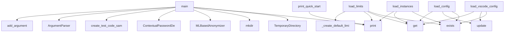

# System Architecture Analysis

## Overview

- **Project**: /home/tom/github/semcod/llx
- **Primary Language**: python
- **Languages**: python: 190, yaml: 59, shell: 32, yml: 10, txt: 4
- **Analysis Mode**: static
- **Total Functions**: 1903
- **Total Classes**: 232
- **Modules**: 315
- **Entry Points**: 1619

## Architecture by Module

### project.map.toon
- **Functions**: 609
- **File**: `map.toon.yaml`

### llx.tools.config_manager
- **Functions**: 45
- **Classes**: 1
- **File**: `config_manager.py`

### llx.tools.vscode_manager
- **Functions**: 38
- **Classes**: 1
- **File**: `vscode_manager.py`

### llx.orchestration.routing.engine
- **Functions**: 38
- **Classes**: 1
- **File**: `engine.py`

### llx.tools.model_manager
- **Functions**: 36
- **Classes**: 1
- **File**: `model_manager.py`

### llx.prellm.trace
- **Functions**: 29
- **Classes**: 2
- **File**: `trace.py`

### llx.orchestration.llm.orchestrator
- **Functions**: 28
- **Classes**: 1
- **File**: `orchestrator.py`

### llx.tools.health_checker
- **Functions**: 27
- **Classes**: 1
- **File**: `health_checker.py`

### llx.orchestration.vscode.orchestrator
- **Functions**: 27
- **Classes**: 1
- **File**: `orchestrator.py`

### llx.tools.docker_manager
- **Functions**: 24
- **Classes**: 1
- **File**: `docker_manager.py`

### llx.analysis.collector
- **Functions**: 21
- **Classes**: 1
- **File**: `collector.py`

### llx.orchestration.queue.manager
- **Functions**: 21
- **Classes**: 1
- **File**: `manager.py`

### llx.orchestration.session.manager
- **Functions**: 20
- **Classes**: 1
- **File**: `manager.py`

### llx.orchestration.ratelimit.limiter
- **Functions**: 20
- **Classes**: 1
- **File**: `limiter.py`

### llx.cli.app
- **Functions**: 19
- **File**: `app.py`

### llx.planfile.generate_strategy
- **Functions**: 19
- **File**: `generate_strategy.py`

### llx.orchestration.instances.manager
- **Functions**: 18
- **Classes**: 1
- **File**: `manager.py`

### llx.tools.ai_tools_manager
- **Functions**: 17
- **Classes**: 1
- **File**: `ai_tools_manager.py`

### llx.mcp.tools
- **Functions**: 17
- **Classes**: 1
- **File**: `tools.py`

### llx.privacy.deanonymize
- **Functions**: 16
- **Classes**: 4
- **File**: `deanonymize.py`

## Key Entry Points

Main execution flows into the system:

### examples.privacy.advanced.01_api_integration.main
- **Calls**: Taskfile.print, Taskfile.print, Taskfile.print, tempfile.TemporaryDirectory, project_path.mkdir, Taskfile.print, Taskfile.print, examples.privacy.advanced.01_api_integration.create_realistic_project

### examples.privacy.ml.04_behavioral_learning.main
- **Calls**: Taskfile.print, Taskfile.print, Taskfile.print, Taskfile.print, Taskfile.print, Taskfile.print, Taskfile.print, Taskfile.print

### examples.privacy.advanced.02_multi_stage.main
- **Calls**: Taskfile.print, Taskfile.print, Taskfile.print, tempfile.TemporaryDirectory, project_path.mkdir, Taskfile.print, Taskfile.print, examples.privacy.advanced.02_multi_stage.create_business_logic_project

### examples.privacy.ml.01_entropy_ml_detection.main
- **Calls**: Taskfile.print, Taskfile.print, Taskfile.print, MLBasedAnonymizer, Taskfile.print, Taskfile.print, Taskfile.print, Taskfile.print

### examples.privacy.ml.03_contextual_passwords.main
- **Calls**: Taskfile.print, Taskfile.print, Taskfile.print, ContextualPasswordDetector, examples.privacy.ml.03_contextual_passwords.create_test_code_samples, samples.items, Taskfile.print, Taskfile.print

### examples.privacy.project.01_anonymize_project.main
- **Calls**: Taskfile.print, Taskfile.print, Taskfile.print, tempfile.TemporaryDirectory, project_path.mkdir, Taskfile.print, Taskfile.print, examples.privacy.project.01_anonymize_project.create_sample_project

### examples.privacy.streaming.01_streaming_anonymization.main
- **Calls**: Taskfile.print, Taskfile.print, Taskfile.print, tempfile.TemporaryDirectory, project_path.mkdir, Taskfile.print, Taskfile.print, examples.privacy.streaming.01_streaming_anonymization.create_large_project

### examples.privacy.project.02_deanonymize_project.main
- **Calls**: Taskfile.print, Taskfile.print, Taskfile.print, tempfile.TemporaryDirectory, project_path.mkdir, src_file.write_text, Taskfile.print, Taskfile.print

### scripts.pyqual_auto.main
- **Calls**: argparse.ArgumentParser, parser.add_argument, parser.add_argument, parser.add_argument, parser.add_argument, parser.add_argument, parser.add_argument, parser.parse_args

### llx.orchestration.instances.manager.InstanceManager.load_instances
> Load instances from configuration file.
- **Calls**: self.config_file.exists, data.get, Taskfile.print, Taskfile.print, Taskfile.print, open, json.load, InstanceConfig

### examples.privacy.advanced.03_cicd_integration.main
- **Calls**: Taskfile.print, Taskfile.print, Taskfile.print, tempfile.TemporaryDirectory, project_path.mkdir, Taskfile.print, Taskfile.print, examples.privacy.advanced.03_cicd_integration.create_cicd_project

### llx.tools.vscode_manager.VSCodeManager.print_quick_start
> Print quick start guide.
- **Calls**: Taskfile.print, Taskfile.print, Taskfile.print, Taskfile.print, Taskfile.print, Taskfile.print, Taskfile.print, Taskfile.print

### llx.orchestration.vscode.config_io.load_vscode_config
> Load VS Code orchestration configuration into an orchestrator instance.
- **Calls**: orchestrator.config_file.exists, orchestrator.config.update, data.get, data.get, data.get, Taskfile.print, Taskfile.print, orchestrator._create_default_config

### llx.orchestration.vscode.orchestrator.VSCodeOrchestrator.load_config
> Load VS Code orchestration configuration.
- **Calls**: self.config_file.exists, self.config.update, data.get, data.get, data.get, Taskfile.print, Taskfile.print, self._create_default_config

### llx.orchestration.ratelimit.limiter.RateLimiter.load_limits
> Load rate limits from configuration file.
- **Calls**: self.config_file.exists, data.get, Taskfile.print, Taskfile.print, self._create_default_limits, Taskfile.print, open, json.load

### llx.orchestration.ratelimit._persistence.load_limits_from_file
> Load rate limits from configuration file.
- **Calls**: self.config_file.exists, data.get, Taskfile.print, Taskfile.print, self._create_default_limits, Taskfile.print, open, json.load

### llx.planfile.generate_strategy.main
> Generate a complete strategy using the fixed generator.
- **Calls**: console.print, Path, Panel, llx.planfile.generate_strategy.generate_strategy_with_fix, llx.planfile.generate_strategy.save_fixed_strategy, console.print, console.print, console.print

### llx.orchestration.session.manager.SessionManager.load_sessions
> Load sessions from configuration file.
- **Calls**: self.config_file.exists, data.get, Taskfile.print, Taskfile.print, Taskfile.print, open, json.load, SessionConfig

### llx.orchestration.queue.manager.QueueManager.load_queues
> Load queues from configuration file.
- **Calls**: self.config_file.exists, data.get, Taskfile.print, Taskfile.print, Taskfile.print, open, json.load, QueueConfig

### llx.tools.health_checker.HealthChecker.monitor_services
> Monitor services over time.
- **Calls**: Taskfile.print, Taskfile.print, time.time, Taskfile.print, None.analyze_monitoring_data, Taskfile.print, Taskfile.print, Taskfile.print

### llx.orchestration.llm.orchestrator.LLMOrchestrator.load_config
> Load LLM orchestration configuration.
- **Calls**: llx.orchestration._utils.load_json, self.config.update, data.get, Taskfile.print, Taskfile.print, self._create_default_config, Taskfile.print, data.get

### llx.orchestration.queue.manager.QueueManager.print_status_summary
> Print comprehensive status summary.
- **Calls**: Taskfile.print, Taskfile.print, len, sum, sum, sum, Taskfile.print, Taskfile.print

### llx.prellm.cli_commands.decompose
> [v0.2] Decompose a query using small LLM without calling the large model.
- **Calls**: typer.Argument, typer.Option, typer.Option, typer.Option, PreLLM, DecompositionStrategy, asyncio.run, engine.decompose_only

### llx.orchestration.ratelimit.limiter.RateLimiter.print_status_summary
> Print comprehensive status summary.
- **Calls**: Taskfile.print, Taskfile.print, len, sum, Taskfile.print, Taskfile.print, Taskfile.print, Taskfile.print

### llx.mcp.tools._handle_aider
> Run aider AI pair programming tool.
- **Calls**: Path, args.get, args.get, args.get, args.get, args.get, args.get, docker_cmd.extend

### examples.privacy.basic.01_text_anonymization.main
- **Calls**: Taskfile.print, Taskfile.print, Taskfile.print, Taskfile.print, Taskfile.print, Taskfile.print, Taskfile.print, Taskfile.print

### examples.privacy.basic.02_custom_patterns.main
- **Calls**: Taskfile.print, Taskfile.print, Taskfile.print, Anonymizer, anon.add_pattern, anon.add_pattern, anon.add_pattern, Taskfile.print

### llx.prellm.pipeline_ops.execute_v3_pipeline
> Two-agent execution path — PreprocessorAgent + ExecutorAgent + PromptPipeline.

v0.4 refactor: uses context_ops and pipeline_ops modules to reduce com
- **Calls**: kwargs.pop, kwargs.pop, LLMProviderConfig, LLMProviderConfig, LLMProvider, LLMProvider, PromptRegistry, PromptPipeline.from_yaml

### llx.tools.docker_manager.DockerManager.print_status_summary
> Print comprehensive status summary.
- **Calls**: Taskfile.print, Taskfile.print, self.get_service_status, Taskfile.print, status.items, Taskfile.print, self.services.keys, self.get_resource_usage

### llx.config.LlxConfig.load
> Load configuration from llx.yaml, llx.toml, or pyproject.toml.
- **Calls**: None.resolve, cls, LiteLLMConfig.load, yaml_path.exists, pyproject.exists, llx.config._apply_env, llx.config.normalize_litellm_base_url, toml_path.exists

## Process Flows

Key execution flows identified:

### Flow 1: main
```
main [examples.privacy.advanced.01_api_integration]
  └─ →> print
  └─ →> print
```

### Flow 2: load_instances
```
load_instances [llx.orchestration.instances.manager.InstanceManager]
  └─ →> print
  └─ →> print
```

### Flow 3: print_quick_start
```
print_quick_start [llx.tools.vscode_manager.VSCodeManager]
  └─ →> print
  └─ →> print
```

### Flow 4: load_vscode_config
```
load_vscode_config [llx.orchestration.vscode.config_io]
```

### Flow 5: load_config
```
load_config [llx.orchestration.vscode.orchestrator.VSCodeOrchestrator]
```

### Flow 6: load_limits
```
load_limits [llx.orchestration.ratelimit.limiter.RateLimiter]
  └─ →> print
  └─ →> print
```

### Flow 7: load_limits_from_file
```
load_limits_from_file [llx.orchestration.ratelimit._persistence]
  └─ →> print
  └─ →> print
```

### Flow 8: load_sessions
```
load_sessions [llx.orchestration.session.manager.SessionManager]
  └─ →> print
  └─ →> print
```

### Flow 9: load_queues
```
load_queues [llx.orchestration.queue.manager.QueueManager]
  └─ →> print
  └─ →> print
```

### Flow 10: monitor_services
```
monitor_services [llx.tools.health_checker.HealthChecker]
  └─ →> print
  └─ →> print
```

## Key Classes

### llx.orchestration.routing.engine.RoutingEngine
> Intelligent routing engine for LLM and VS Code requests.
- **Methods**: 38
- **Key Methods**: llx.orchestration.routing.engine.RoutingEngine.__init__, llx.orchestration.routing.engine.RoutingEngine.load_config, llx.orchestration.routing.engine.RoutingEngine.save_config, llx.orchestration.routing.engine.RoutingEngine.route_request, llx.orchestration.routing.engine.RoutingEngine._get_candidates, llx.orchestration.routing.engine.RoutingEngine._get_llm_candidates, llx.orchestration.routing.engine.RoutingEngine._get_vscode_candidates, llx.orchestration.routing.engine.RoutingEngine._get_ai_tools_candidates, llx.orchestration.routing.engine.RoutingEngine._filter_candidates, llx.orchestration.routing.engine.RoutingEngine._filter_by_rate_limits

### llx.tools.config_manager.ConfigManager
> Manages llx configuration files and settings.
- **Methods**: 30
- **Key Methods**: llx.tools.config_manager.ConfigManager.__init__, llx.tools.config_manager.ConfigManager.load_config, llx.tools.config_manager.ConfigManager.save_config, llx.tools.config_manager.ConfigManager._load_env_file, llx.tools.config_manager.ConfigManager._save_env_file, llx.tools.config_manager.ConfigManager.create_default_env, llx.tools.config_manager.ConfigManager.update_env_var, llx.tools.config_manager.ConfigManager.get_env_var, llx.tools.config_manager.ConfigManager.validate_env_config, llx.tools.config_manager.ConfigManager.get_llx_config

### llx.orchestration.llm.orchestrator.LLMOrchestrator
> Orchestrates multiple LLM providers and models with intelligent routing.
- **Methods**: 28
- **Key Methods**: llx.orchestration.llm.orchestrator.LLMOrchestrator.__init__, llx.orchestration.llm.orchestrator.LLMOrchestrator.load_config, llx.orchestration.llm.orchestrator.LLMOrchestrator.save_config, llx.orchestration.llm.orchestrator.LLMOrchestrator._create_default_config, llx.orchestration.llm.orchestrator.LLMOrchestrator.start, llx.orchestration.llm.orchestrator.LLMOrchestrator.stop, llx.orchestration.llm.orchestrator.LLMOrchestrator.add_provider, llx.orchestration.llm.orchestrator.LLMOrchestrator.remove_provider, llx.orchestration.llm.orchestrator.LLMOrchestrator.add_model, llx.orchestration.llm.orchestrator.LLMOrchestrator.complete_request

### llx.orchestration.vscode.orchestrator.VSCodeOrchestrator
> Orchestrates multiple VS Code instances with intelligent management.
- **Methods**: 27
- **Key Methods**: llx.orchestration.vscode.orchestrator.VSCodeOrchestrator.__init__, llx.orchestration.vscode.orchestrator.VSCodeOrchestrator.load_config, llx.orchestration.vscode.orchestrator.VSCodeOrchestrator.save_config, llx.orchestration.vscode.orchestrator.VSCodeOrchestrator._create_default_config, llx.orchestration.vscode.orchestrator.VSCodeOrchestrator.start, llx.orchestration.vscode.orchestrator.VSCodeOrchestrator.stop, llx.orchestration.vscode.orchestrator.VSCodeOrchestrator.add_account, llx.orchestration.vscode.orchestrator.VSCodeOrchestrator.remove_account, llx.orchestration.vscode.orchestrator.VSCodeOrchestrator.create_instance, llx.orchestration.vscode.orchestrator.VSCodeOrchestrator.remove_instance

### llx.tools.model_manager.ModelManager
> Manages local Ollama models and llx configurations.
- **Methods**: 24
- **Key Methods**: llx.tools.model_manager.ModelManager.__init__, llx.tools.model_manager.ModelManager.check_ollama_running, llx.tools.model_manager.ModelManager.check_llx_running, llx.tools.model_manager.ModelManager.get_ollama_models, llx.tools.model_manager.ModelManager.get_llx_models, llx.tools.model_manager.ModelManager.pull_model, llx.tools.model_manager.ModelManager.remove_model, llx.tools.model_manager.ModelManager.test_model, llx.tools.model_manager.ModelManager.test_llx_model, llx.tools.model_manager.ModelManager.get_model_info

### llx.tools.vscode_manager.VSCodeManager
> Manages VS Code server with AI extensions.
- **Methods**: 22
- **Key Methods**: llx.tools.vscode_manager.VSCodeManager.__init__, llx.tools.vscode_manager.VSCodeManager.is_vscode_running, llx.tools.vscode_manager.VSCodeManager.start_vscode, llx.tools.vscode_manager.VSCodeManager.stop_vscode, llx.tools.vscode_manager.VSCodeManager.restart_vscode, llx.tools.vscode_manager.VSCodeManager.wait_for_vscode_ready, llx.tools.vscode_manager.VSCodeManager.check_vscode_health, llx.tools.vscode_manager.VSCodeManager.get_vscode_url, llx.tools.vscode_manager.VSCodeManager.get_vscode_password, llx.tools.vscode_manager.VSCodeManager.install_extensions

### llx.prellm.trace.TraceRecorder
> Records execution trace and generates markdown documentation.
- **Methods**: 21
- **Key Methods**: llx.prellm.trace.TraceRecorder.start, llx.prellm.trace.TraceRecorder.stop, llx.prellm.trace.TraceRecorder.step, llx.prellm.trace.TraceRecorder.set_result, llx.prellm.trace.TraceRecorder.total_duration_ms, llx.prellm.trace.TraceRecorder._generate_markdown_header, llx.prellm.trace.TraceRecorder._generate_markdown_config, llx.prellm.trace.TraceRecorder._generate_markdown_step_details, llx.prellm.trace.TraceRecorder._generate_markdown_decision_path, llx.prellm.trace.TraceRecorder._generate_markdown_result

### llx.orchestration.queue.manager.QueueManager
> Manages multiple request queues with intelligent prioritization.
- **Methods**: 21
- **Key Methods**: llx.orchestration.queue.manager.QueueManager.__init__, llx.orchestration.queue.manager.QueueManager.load_queues, llx.orchestration.queue.manager.QueueManager.save_queues, llx.orchestration.queue.manager.QueueManager.start, llx.orchestration.queue.manager.QueueManager.stop, llx.orchestration.queue.manager.QueueManager.add_queue, llx.orchestration.queue.manager.QueueManager.remove_queue, llx.orchestration.queue.manager.QueueManager.enqueue_request, llx.orchestration.queue.manager.QueueManager.dequeue_request, llx.orchestration.queue.manager.QueueManager.complete_request

### llx.orchestration.session.manager.SessionManager
> Manages multiple sessions with intelligent scheduling and rate limiting.
- **Methods**: 20
- **Key Methods**: llx.orchestration.session.manager.SessionManager.__init__, llx.orchestration.session.manager.SessionManager.load_sessions, llx.orchestration.session.manager.SessionManager.save_sessions, llx.orchestration.session.manager.SessionManager.create_session, llx.orchestration.session.manager.SessionManager.remove_session, llx.orchestration.session.manager.SessionManager.get_available_session, llx.orchestration.session.manager.SessionManager.request_session, llx.orchestration.session.manager.SessionManager.release_session, llx.orchestration.session.manager.SessionManager.get_session_status, llx.orchestration.session.manager.SessionManager.list_sessions

### llx.orchestration.ratelimit.limiter.RateLimiter
> Manages rate limiting for multiple providers and accounts.
- **Methods**: 20
- **Key Methods**: llx.orchestration.ratelimit.limiter.RateLimiter.__init__, llx.orchestration.ratelimit.limiter.RateLimiter.load_limits, llx.orchestration.ratelimit.limiter.RateLimiter.save_limits, llx.orchestration.ratelimit.limiter.RateLimiter._create_default_limits, llx.orchestration.ratelimit.limiter.RateLimiter.add_limit, llx.orchestration.ratelimit.limiter.RateLimiter.remove_limit, llx.orchestration.ratelimit.limiter.RateLimiter.check_rate_limit, llx.orchestration.ratelimit.limiter.RateLimiter.record_request, llx.orchestration.ratelimit.limiter.RateLimiter.release_request, llx.orchestration.ratelimit.limiter.RateLimiter._build_utilization

### llx.prellm.pipeline.PromptPipeline
> Generic pipeline — executes a sequence of LLM + algorithmic steps.

Usage:
    pipeline = PromptPipe
- **Methods**: 18
- **Key Methods**: llx.prellm.pipeline.PromptPipeline.__init__, llx.prellm.pipeline.PromptPipeline.from_yaml, llx.prellm.pipeline.PromptPipeline.execute, llx.prellm.pipeline.PromptPipeline._execute_llm_step, llx.prellm.pipeline.PromptPipeline._execute_algo_step, llx.prellm.pipeline.PromptPipeline._gather_inputs, llx.prellm.pipeline.PromptPipeline._build_user_message, llx.prellm.pipeline.PromptPipeline._evaluate_condition, llx.prellm.pipeline.PromptPipeline.register_algo_handler, llx.prellm.pipeline.PromptPipeline._algo_domain_rule_matcher

### llx.tools.docker_manager.DockerManager
> Manages Docker containers for llx ecosystem.
- **Methods**: 18
- **Key Methods**: llx.tools.docker_manager.DockerManager.__init__, llx.tools.docker_manager.DockerManager.get_compose_cmd, llx.tools.docker_manager.DockerManager.run_compose_cmd, llx.tools.docker_manager.DockerManager.start_environment, llx.tools.docker_manager.DockerManager.stop_environment, llx.tools.docker_manager.DockerManager.restart_service, llx.tools.docker_manager.DockerManager.get_service_status, llx.tools.docker_manager.DockerManager.get_service_logs, llx.tools.docker_manager.DockerManager.check_service_health, llx.tools.docker_manager.DockerManager.wait_for_service

### llx.orchestration.instances.manager.InstanceManager
> Manages multiple Docker instances with intelligent allocation and monitoring.
- **Methods**: 18
- **Key Methods**: llx.orchestration.instances.manager.InstanceManager.__init__, llx.orchestration.instances.manager.InstanceManager.load_instances, llx.orchestration.instances.manager.InstanceManager.save_instances, llx.orchestration.instances.manager.InstanceManager.create_instance, llx.orchestration.instances.manager.InstanceManager.start_instance, llx.orchestration.instances.manager.InstanceManager.stop_instance, llx.orchestration.instances.manager.InstanceManager.remove_instance, llx.orchestration.instances.manager.InstanceManager.get_available_instance, llx.orchestration.instances.manager.InstanceManager.use_instance, llx.orchestration.instances.manager.InstanceManager.get_instance_status

### llx.tools.ai_tools_manager.AIToolsManager
> Manages AI tools container and operations.
- **Methods**: 17
- **Key Methods**: llx.tools.ai_tools_manager.AIToolsManager.__init__, llx.tools.ai_tools_manager.AIToolsManager.is_container_running, llx.tools.ai_tools_manager.AIToolsManager._ensure_llx_api_running, llx.tools.ai_tools_manager.AIToolsManager._start_ai_tools_container, llx.tools.ai_tools_manager.AIToolsManager.start_ai_tools, llx.tools.ai_tools_manager.AIToolsManager.stop_ai_tools, llx.tools.ai_tools_manager.AIToolsManager.restart_ai_tools, llx.tools.ai_tools_manager.AIToolsManager._print_shell_help, llx.tools.ai_tools_manager.AIToolsManager.access_shell, llx.tools.ai_tools_manager.AIToolsManager.execute_command

### llx.prellm.context.user_memory.UserMemory
> Stores user query history and learned preferences.

Usage:
    # SQLite (default, no extra deps)
   
- **Methods**: 15
- **Key Methods**: llx.prellm.context.user_memory.UserMemory.__init__, llx.prellm.context.user_memory.UserMemory._init_sqlite, llx.prellm.context.user_memory.UserMemory._init_chromadb, llx.prellm.context.user_memory.UserMemory.add_interaction, llx.prellm.context.user_memory.UserMemory.get_recent_context, llx.prellm.context.user_memory.UserMemory.get_user_preferences, llx.prellm.context.user_memory.UserMemory.set_preference, llx.prellm.context.user_memory.UserMemory.clear, llx.prellm.context.user_memory.UserMemory.export_session, llx.prellm.context.user_memory.UserMemory.import_session

### llx.tools.health_checker.HealthChecker
> Comprehensive health monitoring for llx ecosystem.
- **Methods**: 15
- **Key Methods**: llx.tools.health_checker.HealthChecker.__init__, llx.tools.health_checker.HealthChecker._build_service_result, llx.tools.health_checker.HealthChecker._check_redis_health, llx.tools.health_checker.HealthChecker._populate_service_details, llx.tools.health_checker.HealthChecker._check_http_health, llx.tools.health_checker.HealthChecker.check_service_health, llx.tools.health_checker.HealthChecker.check_container_health, llx.tools.health_checker.HealthChecker.check_system_resources, llx.tools.health_checker.HealthChecker.check_filesystem_health, llx.tools.health_checker.HealthChecker.check_network_connectivity

### llx.prellm.context.sensitive_filter.SensitiveDataFilter
> Classifies and filters sensitive data from context before LLM calls.
- **Methods**: 14
- **Key Methods**: llx.prellm.context.sensitive_filter.SensitiveDataFilter.__init__, llx.prellm.context.sensitive_filter.SensitiveDataFilter._load_rules, llx.prellm.context.sensitive_filter.SensitiveDataFilter.classify_key, llx.prellm.context.sensitive_filter.SensitiveDataFilter.classify_value, llx.prellm.context.sensitive_filter.SensitiveDataFilter.filter_dict, llx.prellm.context.sensitive_filter.SensitiveDataFilter.filter_context_for_large_llm, llx.prellm.context.sensitive_filter.SensitiveDataFilter.sanitize_text, llx.prellm.context.sensitive_filter.SensitiveDataFilter.get_filter_report, llx.prellm.context.sensitive_filter.SensitiveDataFilter._filter_dict_item, llx.prellm.context.sensitive_filter.SensitiveDataFilter._filter_env_var_item

### llx.prellm.context.codebase_indexer.CodebaseIndexer
> Index a codebase using tree-sitter for AST-based symbol extraction.

Usage:
    indexer = CodebaseIn
- **Methods**: 14
- **Key Methods**: llx.prellm.context.codebase_indexer.CodebaseIndexer.__init__, llx.prellm.context.codebase_indexer.CodebaseIndexer._check_tree_sitter, llx.prellm.context.codebase_indexer.CodebaseIndexer.index_directory, llx.prellm.context.codebase_indexer.CodebaseIndexer._index_file, llx.prellm.context.codebase_indexer.CodebaseIndexer._extract_with_tree_sitter, llx.prellm.context.codebase_indexer.CodebaseIndexer._get_parser, llx.prellm.context.codebase_indexer.CodebaseIndexer._walk_tree, llx.prellm.context.codebase_indexer.CodebaseIndexer._get_line, llx.prellm.context.codebase_indexer.CodebaseIndexer._extract_with_regex, llx.prellm.context.codebase_indexer.CodebaseIndexer._extract_imports

### examples.privacy.ml.02_hybrid_system.HybridAnonymizer
> Combines regex and ML detection for maximum coverage.
- **Methods**: 13
- **Key Methods**: examples.privacy.ml.02_hybrid_system.HybridAnonymizer.__init__, examples.privacy.ml.02_hybrid_system.HybridAnonymizer.calculate_entropy, examples.privacy.ml.02_hybrid_system.HybridAnonymizer.detect_with_regex, examples.privacy.ml.02_hybrid_system.HybridAnonymizer.detect_ml_entropy, examples.privacy.ml.02_hybrid_system.HybridAnonymizer.detect_ml_context, examples.privacy.ml.02_hybrid_system.HybridAnonymizer._classify_entropy_string, examples.privacy.ml.02_hybrid_system.HybridAnonymizer.hybrid_detect, examples.privacy.ml.02_hybrid_system.HybridAnonymizer._merge_results, examples.privacy.ml.02_hybrid_system.HybridAnonymizer.sort_detections, examples.privacy.ml.02_hybrid_system.HybridAnonymizer.create_anonymization_mask

### llx.prellm.analyzers.context_engine.ContextEngine
> Collects context from environment, git, and system for prompt enrichment.

Used by both core Prellm 
- **Methods**: 13
- **Key Methods**: llx.prellm.analyzers.context_engine.ContextEngine.__init__, llx.prellm.analyzers.context_engine.ContextEngine.gather, llx.prellm.analyzers.context_engine.ContextEngine.enrich_prompt, llx.prellm.analyzers.context_engine.ContextEngine.gather_runtime, llx.prellm.analyzers.context_engine.ContextEngine._auto_collect_env, llx.prellm.analyzers.context_engine.ContextEngine._gather_process, llx.prellm.analyzers.context_engine.ContextEngine._gather_locale, llx.prellm.analyzers.context_engine.ContextEngine._gather_network, llx.prellm.analyzers.context_engine.ContextEngine._gather_env, llx.prellm.analyzers.context_engine.ContextEngine._gather_git

## Data Transformation Functions

Key functions that process and transform data:

### llx.commands._patch_apply._parse_unified_hunks
> Parse a unified diff into hunks.
- **Output to**: re.compile, patch_text.splitlines, hunk_header.match, llx.commands._patch_apply._classify_line, llx.commands._patch_apply._finalize_hunk

### llx.privacy._streaming_impl.StreamingProjectAnonymizer._process_batch
- **Output to**: self._process_file, progress_callback

### llx.privacy._streaming_impl.StreamingProjectAnonymizer._process_file
- **Output to**: str, file_path.relative_to, sum, self._anonymize_large_file, self.anonymizer.anonymize_file

### llx.privacy._streaming_chunking.ChunkedProcessor.process_file
- **Output to**: Path, file_path.stat, self._split_and_process, self._process_small_file

### llx.privacy._streaming_chunking.ChunkedProcessor._process_small_file
- **Output to**: file_path.read_text, anonymizer_func, ChunkResult

### llx.privacy._streaming_chunking.ChunkedProcessor._split_and_process
- **Output to**: open, len, anonymizer_func, line.encode, line.encode

### llx.pyqual_plugins.detect_secrets._run_detect_secrets_subprocess
> Execute the detect-secrets subprocess and handle errors.
- **Output to**: subprocess.run, Taskfile.print, Taskfile.print, Taskfile.print, Taskfile.print

### llx.pyqual_plugins.bump_version.parse_version
> Parse version string into components.
- **Output to**: re.match, ValueError, int, int, int

### llx.pyqual_plugins.lint.run_ruff_format_check
> Run ruff format check.
- **Output to**: Taskfile.print, subprocess.run, Taskfile.print, Taskfile.print, Taskfile.print

### llx.examples.utils.TaskQueue.process
> Process all tasks in queue.
- **Output to**: os.remove, Taskfile.print, os.path.exists, Taskfile.print, open

### llx.prellm.cli_config._format_config_sections
> Group config entries into categorized sections for display.
- **Output to**: entries.items, None.append, None.append, var.startswith, None.append

### llx.prellm.cli.process
> Execute a DevOps process chain.
- **Output to**: app.command, typer.Argument, typer.Option, typer.Option, typer.Option

### llx.prellm.trace._format_tree_value
> Format a value for display in the decision tree — no truncation.
- **Output to**: isinstance, str, isinstance, json.dumps, val.replace

### llx.prellm.extractors.format_classification_context
> Extract and format classification context from preprocessing result.
- **Output to**: state.get, isinstance, state.get, classification.get, classification.get

### llx.prellm.extractors.format_context_schema
> Extract and format context schema information.
- **Output to**: extra_context.get, schema_data.get, schema_data.get, schema_data.get, isinstance

### llx.prellm.extractors.format_runtime_context
> Extract and format runtime context information.
- **Output to**: extra_context.get, runtime.get, runtime.get, sys_info.get, sys_info.get

### llx.prellm.extractors.format_user_context
> Extract and format user context information.
- **Output to**: extra_context.get, parts.append

### llx.prellm.server._parse_model_pair
> Parse 'prellm:qwen→claude' or 'prellm:small→large' into (small, large) model strings.

Special cases
- **Output to**: model_str.split, None.lower, pair.split, len, pair.split

### llx.prellm.server.batch_process
> Process multiple queries in parallel.
- **Output to**: app.post, HTTPException, asyncio.gather, list, llx.prellm.core.preprocess_and_execute

### llx.prellm._get_process_chain

### llx.prellm.pipeline_ops.run_preprocessing
> Run the small-LLM preprocessing step. Returns (prep_result, duration_ms).
- **Output to**: time.time, preprocessor.preprocess, time.time

### llx.prellm.prompt_registry.PromptRegistry.validate
> Validate that all prompts have non-empty templates. Returns list of error messages.
- **Output to**: self._ensure_loaded, set, self._entries.items, self._entries.keys, errors.append

### llx.prellm.cli_query._execute_and_format_result
> Execute the query and format output.
- **Output to**: asyncio.run, llx.prellm.core.preprocess_and_execute, recorder.stop, typer.echo, recorder.save

### llx.prellm.validators.ResponseValidator.validate
> Validate a dict against a named schema.

Args:
    data: The data dict to validate (typically parsed
- **Output to**: self._ensure_loaded, self._schemas.get, schema.types.items, schema.constraints.items, ValidationResult

### llx.prellm.validators.ResponseValidator.validate_or_retry
> Validate, and if invalid, call retry_fn and try again.

Args:
    data: Initial data to validate.
  
- **Output to**: self.validate, logger.info, retry_fn, self.validate

## Behavioral Patterns

### recursion__sanitize
- **Type**: recursion
- **Confidence**: 0.90
- **Functions**: llx.prellm.trace._sanitize

### state_machine_AIToolsManager
- **Type**: state_machine
- **Confidence**: 0.70
- **Functions**: llx.tools.ai_tools_manager.AIToolsManager.__init__, llx.tools.ai_tools_manager.AIToolsManager.is_container_running, llx.tools.ai_tools_manager.AIToolsManager._ensure_llx_api_running, llx.tools.ai_tools_manager.AIToolsManager._start_ai_tools_container, llx.tools.ai_tools_manager.AIToolsManager.start_ai_tools

### state_machine_McpServiceState
- **Type**: state_machine
- **Confidence**: 0.70
- **Functions**: llx.mcp.service.McpServiceState.mark_request, llx.mcp.service.McpServiceState.mark_session_open, llx.mcp.service.McpServiceState.mark_session_close, llx.mcp.service.McpServiceState.mark_message, llx.mcp.service.McpServiceState.mark_error

### state_machine_ProxymClient
- **Type**: state_machine
- **Confidence**: 0.70
- **Functions**: llx.integrations.proxym.ProxymClient.__init__, llx.integrations.proxym.ProxymClient.is_available, llx.integrations.proxym.ProxymClient.status, llx.integrations.proxym.ProxymClient.chat, llx.integrations.proxym.ProxymClient.chat_with_analysis

### state_machine_LlxClient
- **Type**: state_machine
- **Confidence**: 0.70
- **Functions**: llx.routing.client.LlxClient.__init__, llx.routing.client.LlxClient.chat, llx.routing.client.LlxClient.chat_with_context, llx.routing.client.LlxClient._build_payload, llx.routing.client.LlxClient._parse_response

## Public API Surface

Functions exposed as public API (no underscore prefix):

- `examples.privacy.advanced.01_api_integration.main` - 90 calls
- `examples.privacy.ml.04_behavioral_learning.main` - 84 calls
- `examples.privacy.advanced.02_multi_stage.main` - 73 calls
- `examples.privacy.ml.01_entropy_ml_detection.main` - 65 calls
- `examples.privacy.ml.03_contextual_passwords.main` - 64 calls
- `examples.privacy.project.01_anonymize_project.main` - 52 calls
- `examples.privacy.streaming.01_streaming_anonymization.main` - 50 calls
- `llx.prellm.cli_context.context` - 49 calls
- `examples.privacy.project.02_deanonymize_project.main` - 45 calls
- `scripts.pyqual_auto.main` - 43 calls
- `llx.orchestration.instances.manager.InstanceManager.load_instances` - 43 calls
- `examples.privacy.advanced.03_cicd_integration.main` - 42 calls
- `llx.tools.vscode_manager.VSCodeManager.print_quick_start` - 36 calls
- `llx.orchestration.vscode.config_io.load_vscode_config` - 36 calls
- `llx.orchestration.vscode.orchestrator.VSCodeOrchestrator.load_config` - 36 calls
- `llx.orchestration.ratelimit.limiter.RateLimiter.load_limits` - 36 calls
- `llx.orchestration.ratelimit._persistence.load_limits_from_file` - 36 calls
- `llx.planfile.generate_strategy.main` - 35 calls
- `llx.orchestration.session.manager.SessionManager.load_sessions` - 34 calls
- `llx.orchestration.queue.manager.QueueManager.load_queues` - 34 calls
- `llx.tools.health_checker.HealthChecker.monitor_services` - 30 calls
- `llx.orchestration.llm.orchestrator.LLMOrchestrator.load_config` - 30 calls
- `llx.orchestration.queue.manager.QueueManager.print_status_summary` - 30 calls
- `llx.prellm.cli_commands.decompose` - 29 calls
- `llx.orchestration.ratelimit.limiter.RateLimiter.print_status_summary` - 29 calls
- `llx.mcp.workflows.run_llx_fix_workflow` - 28 calls
- `examples.privacy.basic.01_text_anonymization.main` - 27 calls
- `examples.privacy.basic.02_custom_patterns.main` - 27 calls
- `llx.prellm.pipeline_ops.execute_v3_pipeline` - 27 calls
- `llx.tools.docker_manager.DockerManager.print_status_summary` - 27 calls
- `llx.mcp.service.create_service_app` - 27 calls
- `llx.config.LlxConfig.load` - 26 calls
- `llx.orchestration.session.manager.SessionManager.print_status_summary` - 26 calls
- `llx.prellm.cli_config.config_show_cmd` - 25 calls
- `llx.prellm.cli_commands.budget` - 25 calls
- `llx.orchestration.vscode.orchestrator.VSCodeOrchestrator.print_status_summary` - 25 calls
- `examples.privacy.advanced.03_cicd_integration.CICDPrivacyPipeline.step1_pre_commit_scan` - 24 calls
- `llx.prellm.env_config.get_env_config` - 24 calls
- `llx.tools.vscode_manager.VSCodeManager.install_extensions` - 24 calls
- `llx.tools.config_manager.ConfigManager.restore_configs` - 23 calls

## System Interactions

How components interact:



## Reverse Engineering Guidelines

1. **Entry Points**: Start analysis from the entry points listed above
2. **Core Logic**: Focus on classes with many methods
3. **Data Flow**: Follow data transformation functions
4. **Process Flows**: Use the flow diagrams for execution paths
5. **API Surface**: Public API functions reveal the interface

## Context for LLM

Maintain the identified architectural patterns and public API surface when suggesting changes.